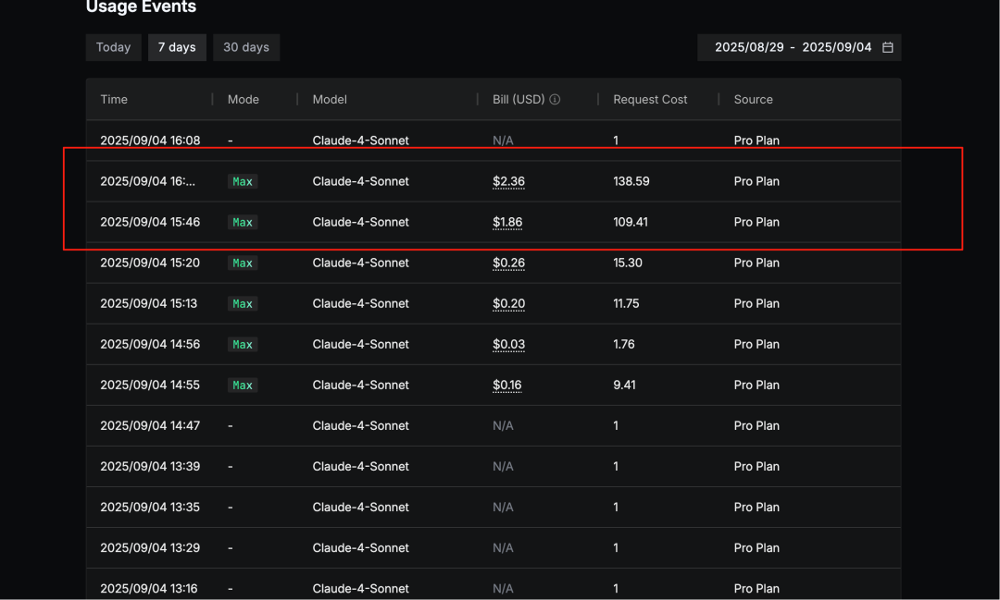
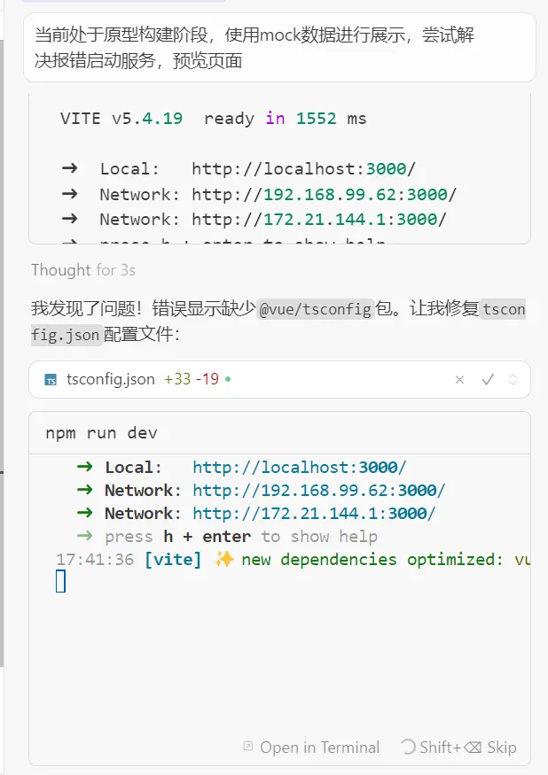
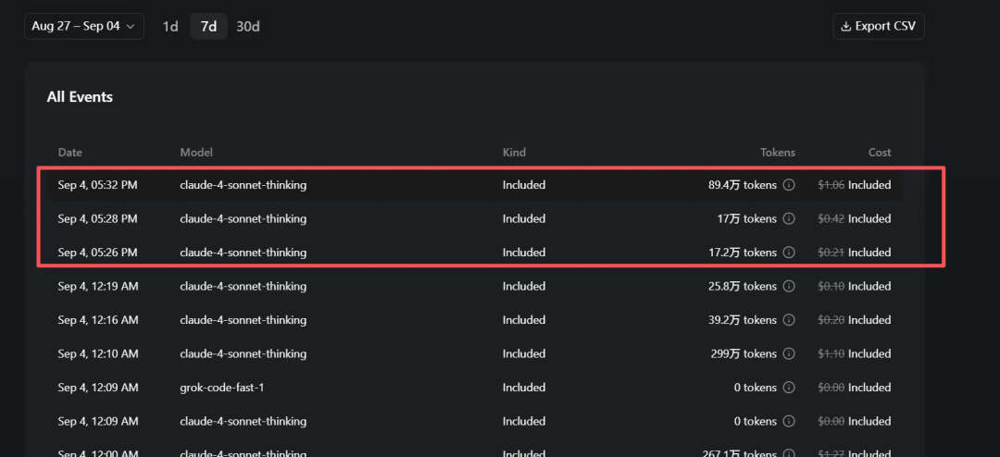

# 字节AI编程工具Trae正式发布Max模式，深度测试完劝你。。。

## 字节 Trae Max 模式上线，号称“一句话搞定复杂项目”

实测结论很直接：我花了 10 美元，买了个教训。

## 血泪经历

今天花 10 美元升级 Max 模式，拿到 600 次调用额度。

我给它的任务并不复杂，只是一个 Vue3 商品展示页面原型，后端都还没开始做。结果 1 小时就烧掉接近 300 次调用，依然在报引用这类低级错误，连页面长什么样都没看到。

## 成本明细

- 消耗调用：295 次，差不多吃掉一半月额度
- 项目完成度：0%
- 时间浪费：1 小时

## Max 模式真相

### 问题 1：递归式错误修复死循环

一个 bug 修完，又冒出两个新 bug。

AI 接着自动修，又引出三个新错误。

最后就是无限循环，调用次数指数增长。

### 问题 2：上下文更长，带来的更多是浪费

模型能力本身没有提升，变化更像是单纯把上下文窗口拉大。结果就是模型更容易在更长的上下文里自我循环、自我消耗，token 越烧越多，但事情不一定做得更好。

### 调用方式对比

- 普通模式：5k-15k token，人可以主动控制，整体更精准
- Max 模式：50k-200k token，AI 全量加载，更容易浪费 10 倍成本

## 对比测试

我把 Trae 还原之后，又用 Cursor 跑了一遍同样的任务，结果很残忍：我甚至不用开 Max 模式。

只用了 3 次会话，页面就成功构建出来了。严格说还包括重新理解项目和补充项目规则，真要算核心修改，几乎就是一次。

### Cursor 和 Trae Max 对比

- 月费：Cursor Pro 20 美元，Trae Max 10 美元
- 完成同项目调用数：Cursor 3 次，Trae Max 295 次
- 可用程度：Cursor 85%，Trae Max 0%
- 用户体验：Cursor 流畅可控，Trae Max 一直构建报错

## 踩坑结论

Trae Max 模式的本质，是提高上下文、提高模型自主性，但底层模型能力没有发生质变。

结果就是：你要用更多 token 去做同样的事情，而且还不一定能做好。

### 为什么会这样

- 过度自动化：没有人工及时介入，错误会像滚雪球一样放大
- 上下文污染：大量无关信息混进来，会稀释真正关键的逻辑
- 缺乏反馈机制：方向跑偏以后，很难第一时间拉回来

## 实用建议

### 给用户的建议

如果你要用 Trae，建议还是先用免费模式，一个任务一个任务拆开做，不要当甩手掌柜。

保持参与感，适时介入，AI 才更可能是在帮你，而不是坑你。

### 给 Trae 团队的建议

先把基础能力做稳，再考虑收费。

1 小时就消耗掉用户一半月额度，问题还没解决，这在任何产品里都很难说服用户继续买单。

## 互动话题

你用过哪些 AI 编程工具的付费模式？体验怎么样？

欢迎在评论区分享你的真实感受，我会挑一些典型案例，在后面继续做更细的对比分析。

如果这篇血泪测评帮你避坑，也欢迎转给更多朋友。

## 关于我

60天，从产品经理到独立开发成功上架：vibe coding重新定义了“产品经理”

## 往期精品

大坑！快别往Claude code里加规则了！

*原文发布于：https://mp.weixin.qq.com/s/MrqFfSr8_xaxphlBIYDveg*
