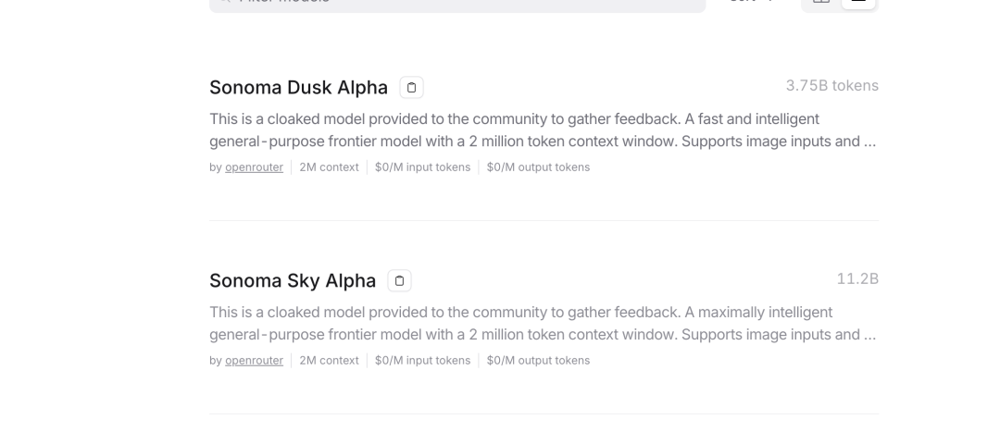
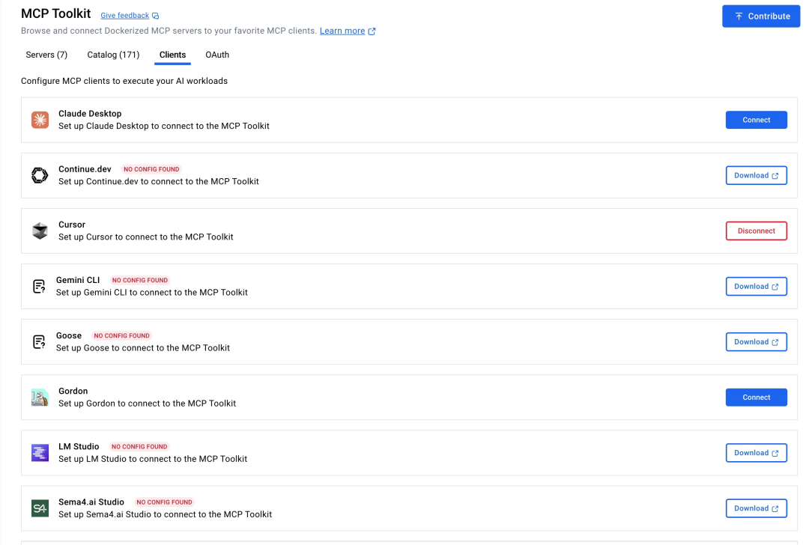

# 猛料！疑似马斯克grok新模型上线，闻所未闻的200万上下文！

今天突然发现 OpenRouter 新上了两个模型，平平无奇的一件事，但上下文标注，居然是 2M！！！也就是 200万 tokens，据一些大佬分析，疑似 xAI 的新货，参数架构基本与 grok 一致。

## ✅ 测试阶段免费用！

直接上 OpenRouter，注册账号，搞个 key，免费爽！

链接:https://openrouter.ai/models

注意：

目前免费调用是为了收集反馈，说明了会收集输入输出数据做优化，

别放敏感信息！！！

### 快速体验方案

- Chatbox: 下载后直接配 OpenRouter 的 key，选这个模型就能用
- Cherry Studio: 界面更友好，适合长期用
- 编程大佬专用:Kilo、Claude Code Router 等工具可以试试改接这个 API，直接喂整个项目让它写代码

有在用的兄弟可以来交流下效果，我这边还在测，计划明天出个实测记录。

## 🤔 一些观察和猜测

从命名和能力看，这应该是 Grok 产品线的重大更新：

- 🚀 200万上下文直接把 Claude 破纪录的100万干翻了！
- 🖼️ 支持图像输入，OCR 和图表解析都没问题，相对前两天的 grok-code-fast1 是个质变。
- 🤖 Agent 化程度更高，明确有工具选择和工具调用能力。
- ⚙️ 双版本策略，看这两个模型的参数量，估计有快速和深度两个版本，满足不同场景。

技术上推测可能用了新的注意力机制或者内存优化，不然这个窗口大小很难做到实用速度。

## 💡 一些行业洞察

一些我个人的看法，有其他看法欢迎随时讨论交流～

### 上下文军备竞赛正式开始：

- Claude 开了100万的头，现在 xAI 直接翻倍。
- 接下来 GPT、Gemini、国内的通义千问、GLM 肯定都会朝这个方向努力。
- 小模型厂商压力山大，得想新路子。

### 应用层要变天了：

- RAG 那套切块、检索的活儿可能要重新想。
- 直接喂全量数据成为可能，信息损失大幅减少。
- 提示工程师要转型做"信息架构师"，怎么把尽量原始尽量完整的信息给大模型，成了我们要研究的核心点！

### 谁会最先受益：

- 代码审计、重构这些场景立马起飞。
- 法务合规、文档比对等传统 AI 弱项有新解法了。
- 研究领域的文献综述效率会质变提升。

## 🎯 值得试试的几个场景

- 把整个项目扔进去，让它画依赖图和重构方案。
- 多版本文档对比，找冲突点和遗漏。
- 大型 codebase 的理解和改进建议。
- 复杂业务逻辑的梳理和文档化。

### 补充一个很想聊的！

最近两周 Claude Code 持续封禁中国账号，这两天更是直接表态说中国是"敌对国家"，中国控股的海外公司都要一刀切封禁。态度相当猖狂，看来是铁了心要跟中国市场切割。

老马同志加油！现在看来 Grok 这个时候上新模型，时机把握得相当精准。建议大家可以提前熟悉熟悉 codex，我最近也在研究，到时候整个详细教程给大家。

后面就靠老马同志了。相比之下，马斯克对中国应该不会有这么大的敌意，毕竟偌大个特斯拉还放在上海呢，哈哈哈。

点个关注 准备接下来的 Grok 体验反馈和深度教程！👇👇👇

## 关于我

60天，从产品经理到独立开发成功上架：vibe coding重新定义了“产品经理”

## 往期精品

大坑！快别往Claude code里加规则了！

Cursor + MCP 终极指南：从频繁断连到一键部署，稳定运行！

*原文发布于：https://mp.weixin.qq.com/s/xrhOXuggvx18OZKIdu64Uw*
