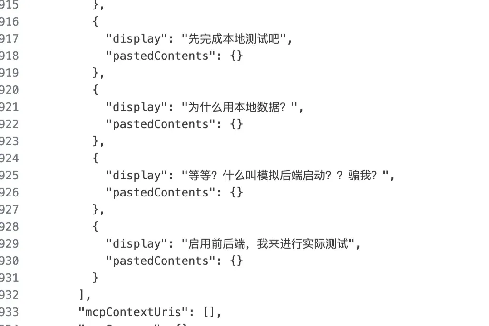
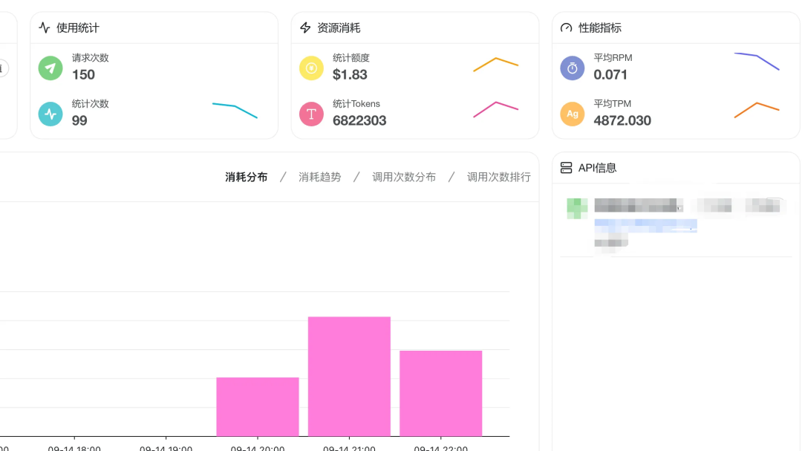

# Claude code反华加降智，教你10元成本爽玩满血codex(gpt-5-high)

一、再见，傻叉Claude！

最近Claude的反华表现，加上Claude 3频繁降智，不光代码里框框写假数据假接口忽悠人，官方自己也认错好几次了。。。如图：

（跟Claude尴尬的聊天记录）

果断弃坑，投奔Codex！

### 二、10元爽用Codex，真香！

以下进入正题，10元爽用Codex！

实话实说，用的一个转接站，有多便宜呢？

昨天，用Codex写了一个完整的macOS app，完整的包括使用协议的全部界面，从聊方案到完整界面实现。。。你猜花了我多少？两块钱！！！

额，说错了，准确说是 1.83元。

不要以为这是美元，这就是人民币！1块8人民币，跑了100多次，将近700万tokens！满血gpt-5-high！

这个地板价格，足够你用到爽。相比原来Claude转接，不稳定还只能包月，一个月大几百，实际用不了几天，这简直不要太爽。

需要的时候就充个10块钱，美美爽一整天，对于我这种三天打鱼两天晒网的人来说，那成本妥妥的飞速下降～

评论区领取注册链接，带邀请码注册有额外奖励！懂得都懂～

### 三、上手！安装与配置教程

第1步：安装Codex

确保自己安装了npm，运行官方安装命令：npm install -g @openai/codex

第2步：获取API密钥

评论区领取站点链接后注册，充值9.8元～够玩一整天！然后生成一个自己的apikey，注意选择codex分组～

第3步：配置环境变量

(mac环境，win环境替换命令或手动配置即可)echo 'export OPENAI_BASE_URL="https://chrisapius.top/v1"' >> ~/.zshrcecho 'export OPENAI_API_KEY="你的api_key"' >> ~/.zshrcsource ~/.zshrc

第4步：启动！

进入项目，打开终端，输入codex，启动启动！

第5步：授权

选择第2项，使用自己的api。

然后就能爽玩了，体会碾压Claude的所谓的“高级工程师”给你打工的快感～

关注我，近期更新codex使用进阶指南～

关于我：

60天，从产品经理到独立开发成功上架：vibe coding重新定义了“产品经理”

往期精品：

大坑！快别往Claude code里加规则了！

Cursor + MCP 终极指南：从频繁断连到一键部署，稳定运行！

*原文发布于：https://mp.weixin.qq.com/s/rfMJ3NVo-9V0K27GJmEPOQ*
