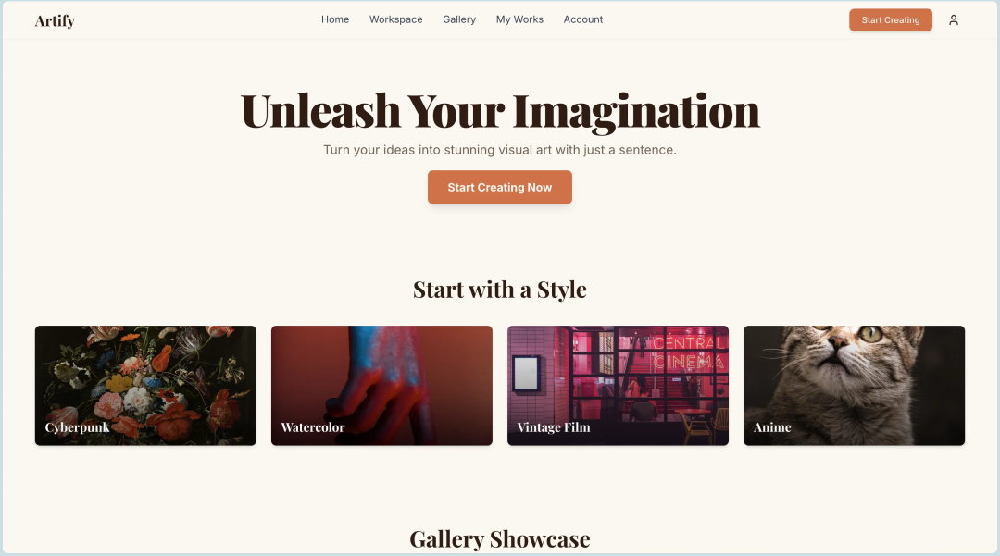
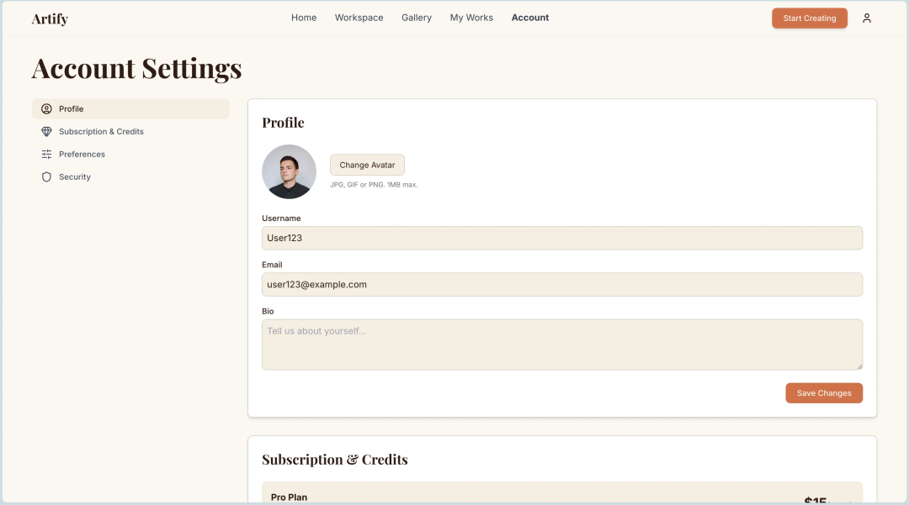
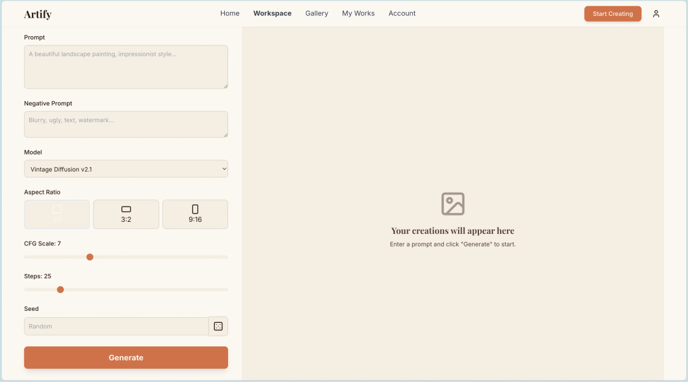
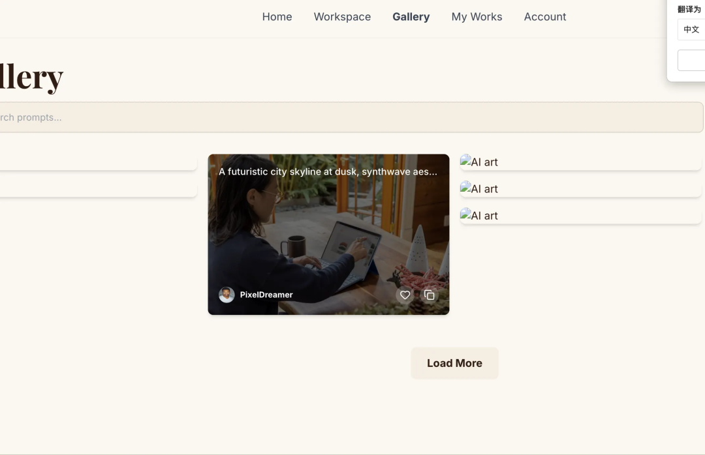
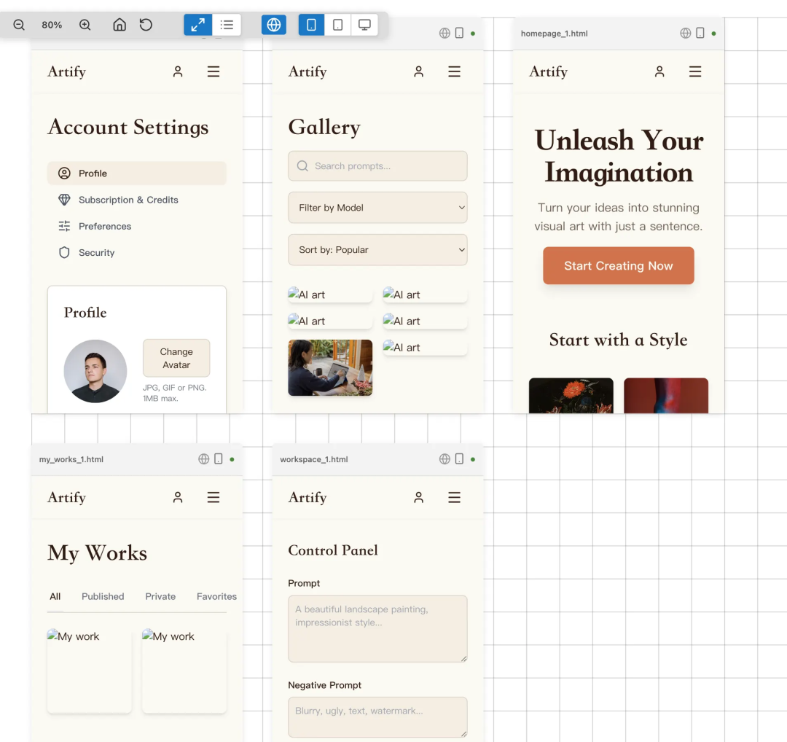
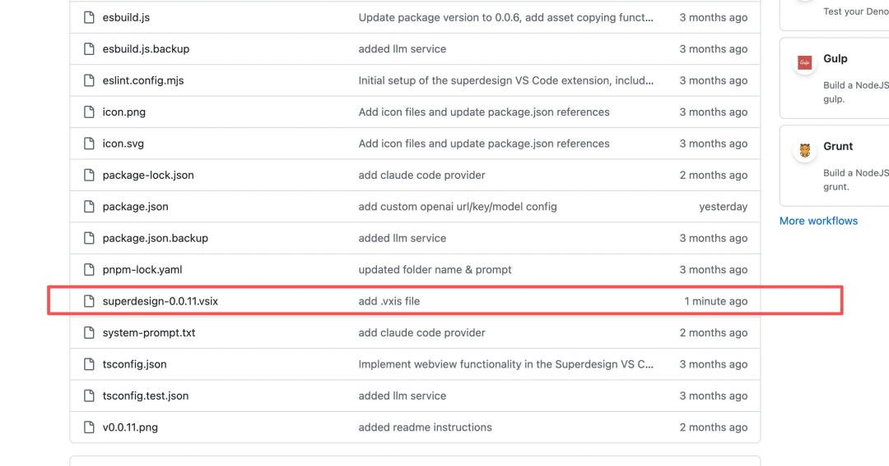
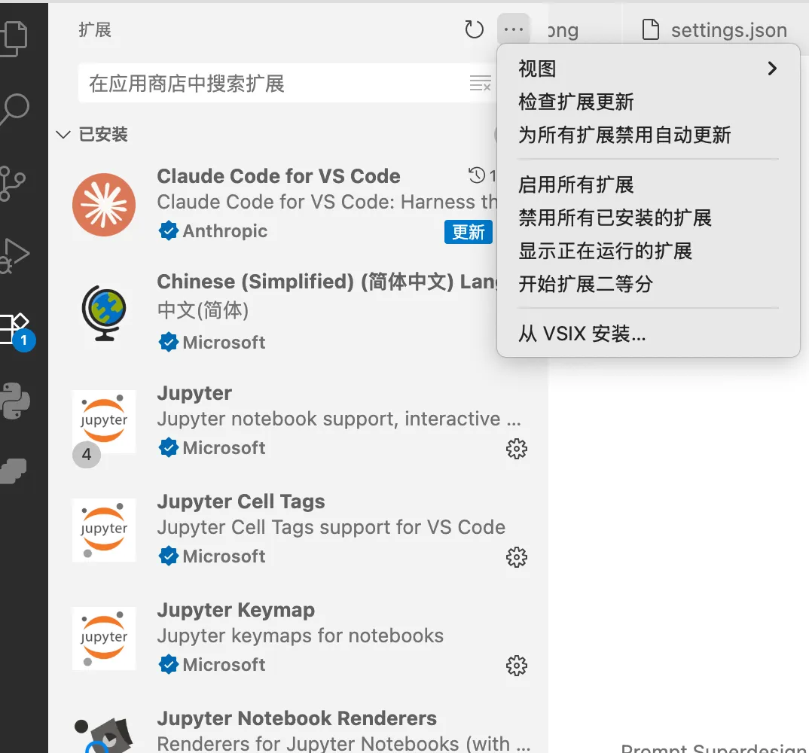
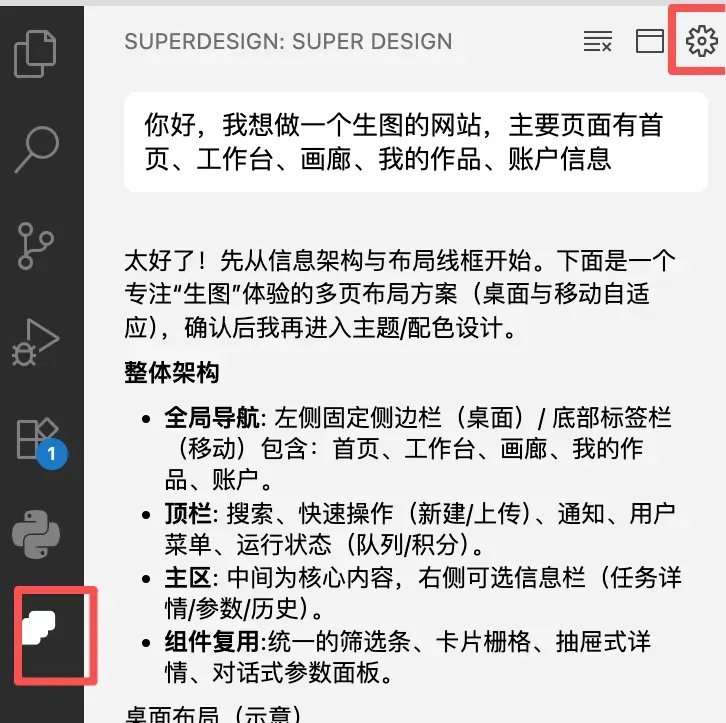

# 有了这款号称UI界的Cursor！再也不担心vibe出来的页面难看啦！

今天要说的，是一款解决UI设计问题的工具，一款专门对UI工作进行了工程化的智能体——superdesign。它是一款开源的vscode插件（cursor、trae等同样支持）。

重点： superdesign一直不支持非官方的大模型url，我fork了一份做了优化，已经可以支持配置非官方的大模型URL了（低价的转发站或者本地ollama等～），比起figma、lovable、bolt一个月20刀，用上这一套，加上个低价的api站，一套原型不到一块钱搞定！

话不多说，先看效果：

我给了非常简单的提示词，让他做一个生图的网站。其他任何信息都没说，并且没有干预他的方案和风格，全凭自由发挥，他会逐步生成并跟你确认网站功能、布局、线稿、风格、配色等，工作流可以说相当专业了，效果如下：

## 主页

## 账户信息

## 工作台（生图页面）

其他页面就不一一展示了，几个我认为的优点总结一下：

- 风格高度统一使用全局的ui规范css文件，生成的风格、配色高度一致，不会出现不同页面组件样式不一样的情况。

- 交互动效完备悬停、点击等动效都已经实现了，完全不用额外考虑。如下图中，画廊页面，悬停则会展示作者和提示词。

- 产品能力通用产品细节和功能不用考虑到每个细节，只需要确定大的功能模块和流程即可。

- 多端自动适配设计时会自己考虑不同的设备适配，完全不用操心不同屏幕的展示效果。

## 重点来啦！

原版仅支持官方API，价格昂贵。我fork的这份魔改版支持自定义URL和模型，配合低价转接站，上面5个页面总花费仅5毛钱！

### 使用流程

GitHub链接打开后下载.vsix文件：

https://github.com/DwDestiny/superdesign

1. vscode进入插件管理，选择 从.vsix安装。

2. 安装成功后，打开扩展设置。

3. 按下述完成配置项：

Provider: openai-compatible

Api Key: 输入你的APIkey

Base Url: 输入你用的转接站URL

Model: 输入你用的model id

4. 然后就可以在聊天框中开始使用啦～

有需要低价api中转的朋友可以私我，可以推荐给你～

## 如果这篇文章解决了你的困惑，请点赞👍分享给更多需要的朋友！

## 关于我

60天，从产品经理到独立开发成功上架：vibe coding重新定义了“产品经理”

## 往期精品

超全超细！独立开发新人避坑指南！一文讲透！

大坑！快别往Claude code里加规则了！

Cursor + MCP 终极指南：从频繁断连到一键部署，稳定运行！

*原文发布于：https://mp.weixin.qq.com/s/aGRdb5LgJ6CAj3KdX52c2Q*
