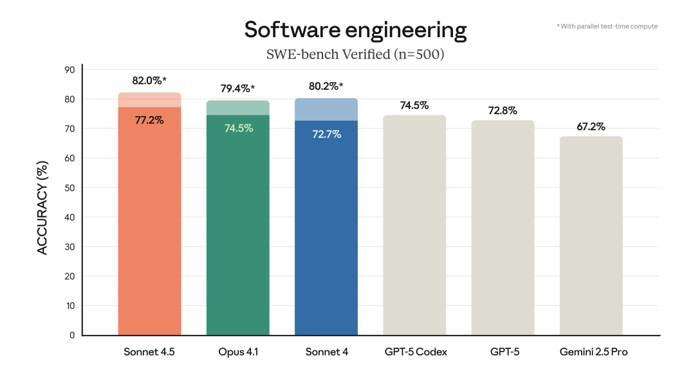
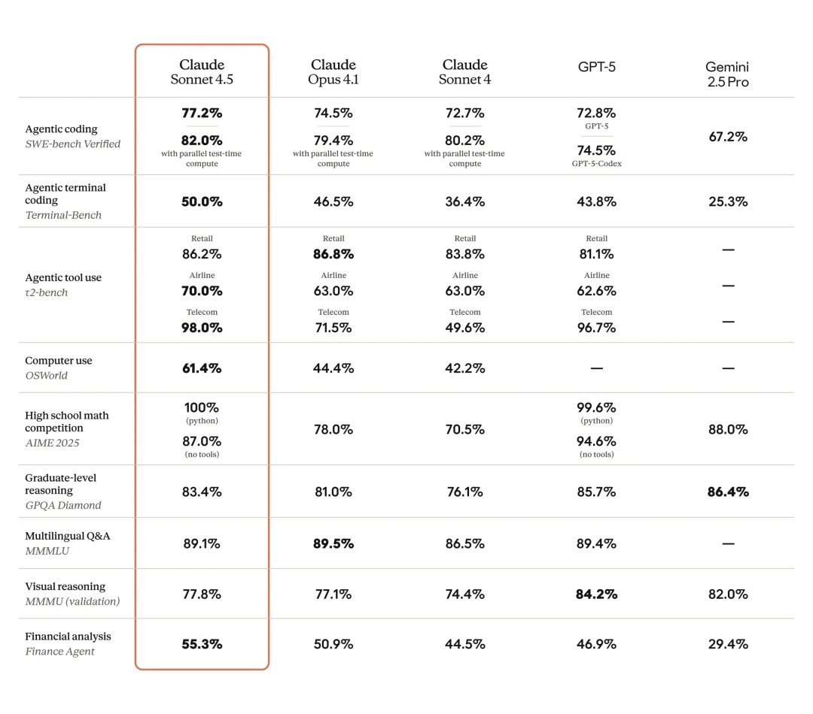
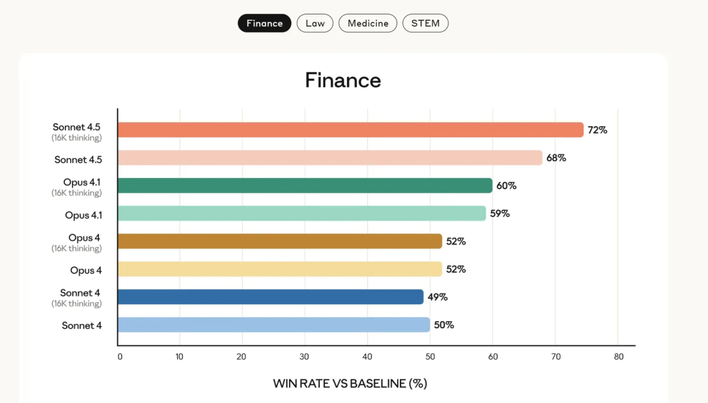
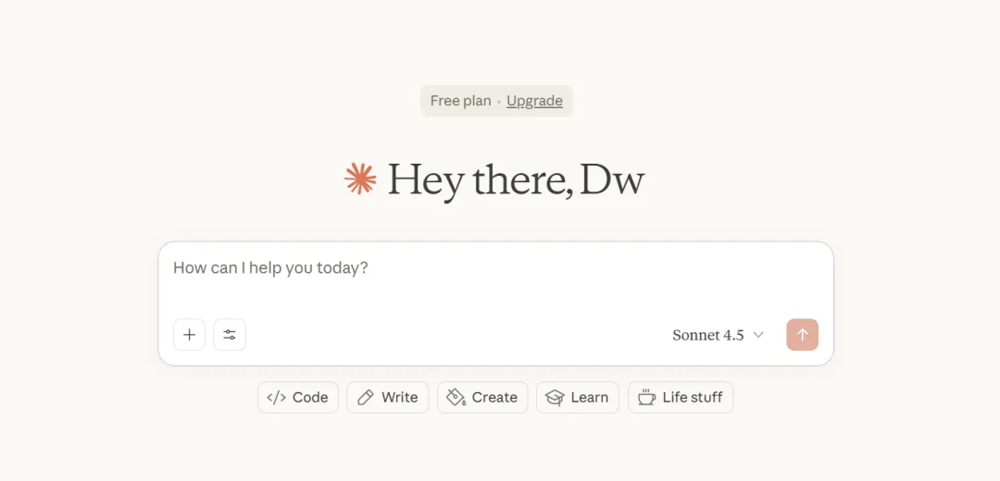

# claude4.5发布！评分超GPT-5-codex，是王的回归还是一坨大的？

Claude-Sonnet-4.5 今日发布！今天，Claude-Sonnet-4.5 正式发布了！Anthropic 这次直接跳过了小版本，从 Sonnet-4 直达 4.5，可谓是诚意满满。话不多说，我们直接来看官方报告的重点解读。官方报告亮点官方一如既往的自信，开头就用连续三个“最好”来定义新模型：最好的编码模型最强的构建智能体（Agent）的模型最好的操作计算机模型定价：定价与 Sonnet-4 保持一致，输入为 $3/百万token，输出为 $15/百万token。能力提升：编码能力： 在编码测试 SWE-bench Verified 中分数最高，超过了 Codex 和 Opus 4.1。计算机操作： 任务上的提升巨大，从之前最高的 Sonnet-4 的 42% 提升到了 61%，可谓是巨幅提升。专家领域： 在金融、医疗、法律等专业领域的表现也都有较大提升。总而言之，单从官方数据来看，旧王回归，碾压 Codex 似乎是妥妥的了。但实际上手能否真正超过 Codex 重登王座，还需要我们亲自体验。如何体验 Sonnet-4.5官方渠道官方网页和 Claude Code 均已上线新模型。免费用户也可以在网页上享受每日的免费额度。Cursor已上线 Sonnet-4.5，价格等同于 Sonnet-4。有续费或教育优惠的朋友可以爽玩一阵~中转 API许多中转 API 也已上线新模型，价格基本上比官方低了十几倍。有资源的朋友可以先玩起来了~博主也在测试中~有需要中转的朋友可以私我下。但总而言之，按照 Claude 家的“尿性”，模型强是强，但中间会不会有啥 bug，有没有偷工减料降智，那还真说不准，毕竟之前俩月 Claude 基本没法用。大家还是要真实测试试一下。另外，GPT 更新了，Claude 更新了，那 Gemini 3 还远吗？可以猛猛期待一波了！如果这篇文章解决了你的困惑，请点赞👍分享给更多需要的朋友！关于我：60天，从产品经理到独立开发成功上架：vibe coding重新定义了“产品经理”往期精品：有了这款号称UI界的Cursor！再也不担心vibe出来的页面难看啦！超全超细！独立开发新人避坑指南！一文讲透！Cursor + MCP 终极指南：从频繁断连到一键部署，稳定运行！

*原文发布于：https://mp.weixin.qq.com/s/JNGcQU9cYus6oVs82bpXWw*
