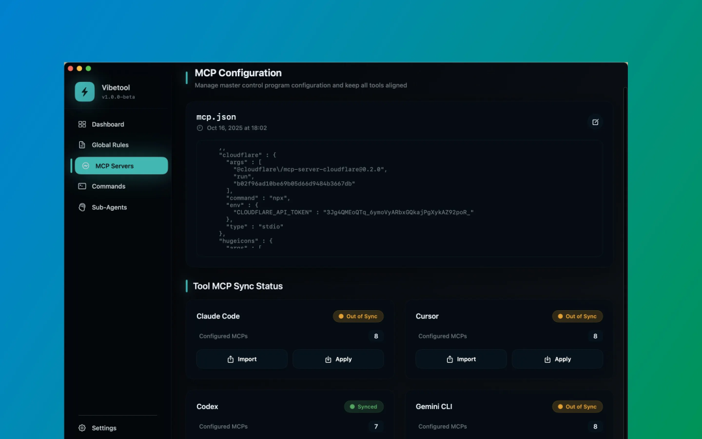
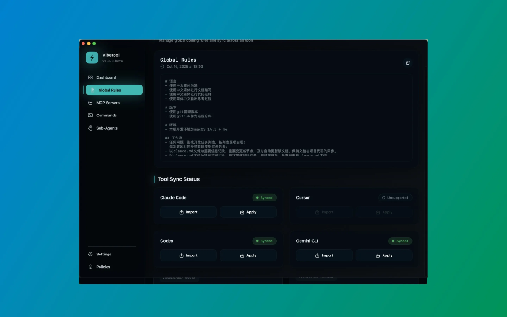
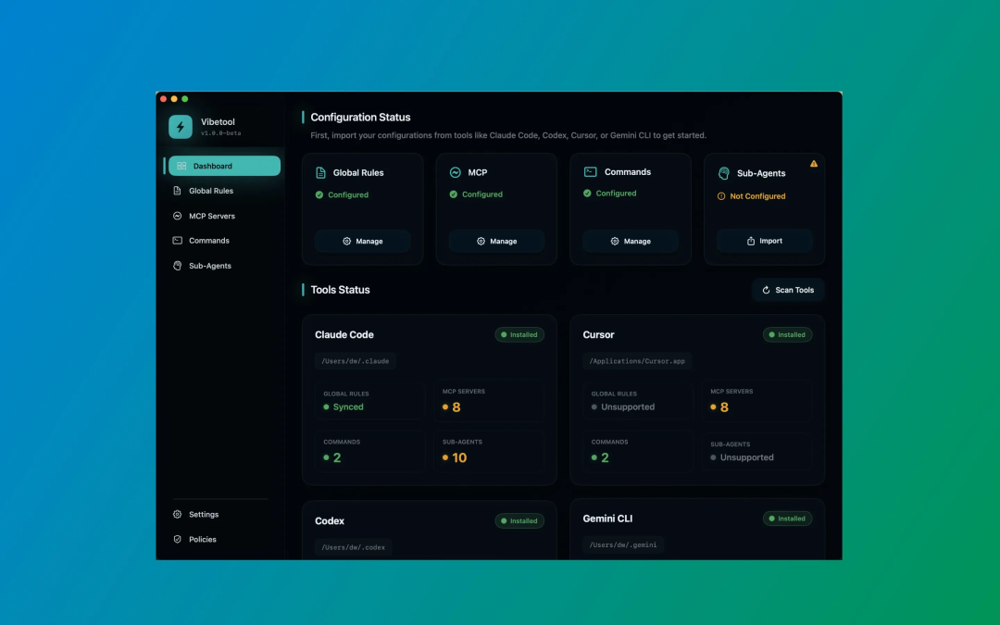

# Claude Code、Cursor、Codex 配置来回改？做了个工具一键同步！

早上用 Claude Code，中午切 Cursor，晚上换 Codex，每次都要重新配 MCP？如果你你早上用 Claude Code 写了个 MCP 服务器配置，JSON 格式：中午切到 codex CLI，发现要 TOML 格式，得手动改：下午用 Cursor，又得去它的配置文件里加一遍。晚上回到 Codex，发现早上改的配置忘同步了，报错。如题，今天要说的是一个专门解决多 AI 编程工具配置同步的工具——Vibe Manager。它是一款 macOS 原生应用，专门给同时用 Claude Code、Cursor、Codex、Gemini CLI 的 vibecoder 设计的。我知道很多人已经有自己的配置同步方案（手动复制、脚本、Git），但 Vibe Manager 的核心优势是：自动格式转换 + 同步状态检测 + 带时间戳备份。Claude 的mcp JSON 配置、codex 的mcp 是 TOML 格式。。。统统一个按钮自动转换同步。改一次，处处生效。比起每次手动改 4 个配置文件，这套方案能省下 80% 的配置时间。二、Vibe Manager 能做什么？🎯 核心功能1. 一键 MCP 同步 在 Vibe Manager 里维护一份 MCP 服务器列表，点击同步，自动转换成对应格式（JSON/TOML）并推送到：Claude CodeCodex CLIGemini CLICursor再也不用记每个工具的配置格式。2. 集中编码规则管理 所有提示词、协作规则、项目模板只需写一次：Claude Code 的 claude.md规则Codex 的 agents.md 配置Gemini CLI 的 gemini.mdcursor目前不行～全局规则好像不是以配置文件方式实现改一次，一键同步到所有工具。3. slash命令自动转换 Claude 的 斜杠命令 和 Cursor/Gemini 的自定义命令，配置格式不一样？ Vibe Manager 自动转换。4. 实时状态检测 仪表板实时显示每个工具的：安装状态（✅已安装 / ⚠️未检测到）同步状态（✅已同步 / 🔄待同步 ）在你覆盖错误配置之前就能看到警告。5. 防篡改备份 每次写入配置都会生成带时间戳的快照，存在 ~/.vibemanager/backups/：2025-10-23-19:00_claude_mcp.json2025-10-23-19:00_cursor_commands.json改崩了？随时回滚到任意历史版本。🔥 对比传统方案：❌ 手动复制粘贴：要改 4 个文件，容易漏、容易错❌ 自己写脚本：要处理格式转换、版本管理、冲突检测，维护成本高❌ Git 同步配置：不同工具的配置文件格式不一样，merge 冲突很麻烦✅ Vibe Manager：自动格式转换 + 可视化管理 + 一键同步 + 自动备份三、开始使用Vibe Manager 目前支持 macOS，已上架，搜索vibe即可看到～（后续会推出 Windows/Linux 版本）。纯客户端工具，所有配置本地管理，不上传任何数据到云端，隐私安全。使用流程：安装 Vibe Manager首次启动会自动检测已安装的 AI 编程工具导入现有配置（可选，也可以从零开始）在可视化界面里管理 MCP、规则、命令点击"同步"按钮，选择要同步的工具完成！之后每次修改配置，只需要在 Vibe Manager 里改一次，一键同步到所有工具。常见问题Q: 支持哪些工具？A: 目前支持 Claude Code、Cursor、Codex CLI、Gemini CLI，后续会根据反馈加入更多工具（如 GitHub Copilot、trae 等）。Q: 会不会覆盖我现有的配置？A: 会，但同步前会提示你确认，且每次写入都会生成备份文件，可以随时回滚。Q: 价格？A: 18元一次性买断～一杯奶茶的价格（尽量挣个时间成本～）💬 互动话题你在用哪些 AI 编程工具？配置同步有什么痛点？在评论区聊聊：A. 手动在多个工具间复制配置，累B. 配置格式不一样，每次都要查文档C. 经常忘记同步，导致工具行为不一致D. 改崩了配置，没备份，只能重新配E. 其他（详细说说）我会根据大家的反馈持续优化 Vibe Manager，并在下期分享vibe开发apple应用实战技巧！如果这篇文章解决了你的困惑，请点赞 👍 分享给更多需要的朋友！关注我，定期分享 AI 编程工具实战干货，让工具成为你的生产力放大器。

*原文发布于：https://mp.weixin.qq.com/s/nvAydMdyXh2KcOl8EhJlzw*
