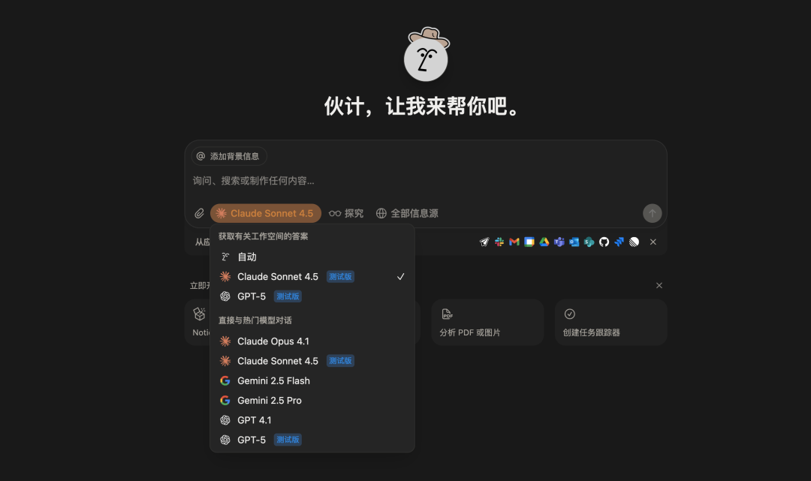
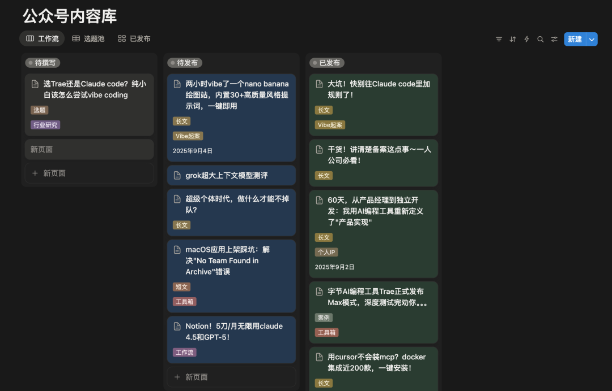
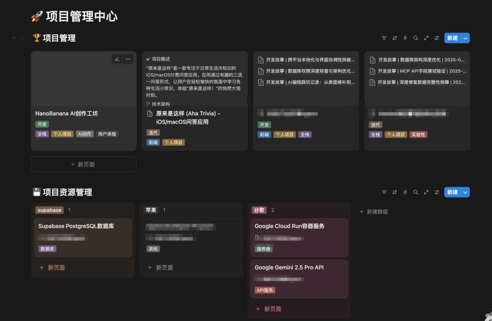

# Notion！5刀/月无限用claude 4.5和GPT-5！

Claude和GPT都是20刀一个月，问两句就限额了，得等明天才能继续。懂得都懂。

最近一直用notion才知道什么叫爽！教育优惠5刀一个月，Claude 4.5和GPT-5随便用，真的不限额！！！

## 为什么用Notion AI

不是说Notion AI比官方版本多厉害，主要是它能看到你整个工作区的上下文。这点对独立开发者来说太香了。

## 我用Notion管了两个数据库

1. 公众号内容库

平时选题、写文章、排版都在这个库里。每篇文章有状态（待撰写/待发布/已发布）、栏目分类、发布渠道。想写文章的时候，直接@AI说"帮我把这个选题展开成文章"，它能看到我之前写过的所有文章风格，生成的内容基本不用大改。

之前用ChatGPT写文章，每次都得把背景、风格、之前的案例复制粘贴一遍。现在@整个数据库，AI自己知道该怎么写。

2. 项目管理中心

里面有项目库和任务库，双向关联。每个项目都能看到下面有哪些任务，每个任务也知道属于哪个项目。

比如我在做"应用截图制作工具"这个项目，下面有十几个任务。我问AI"这个项目下周要交付，帮我看看还有哪些任务没做完"，它直接能从数据库里筛出来，还能按优先级排序。

这就是Notion AI和普通ChatGPT的区别：它不是孤立的对话，它能看到你的整个工作流。

## 几个常见问题

Q: 除了AI模块还有啥？
A: 整个Plus Plan都免费，原价10刀一个月，包括无限文件上传、版本历史这些。

Q: 我不用Notion做笔记值得吗？
A: 只为AI来也值。我主要用它管数据库+AI辅助，笔记还是放本地。

Q: 和官方版比有啥缺点？
A: 上下文窗口略小，不适合超长代码分析。但日常够用，关键是它能看到你的整个工作区。

## 避坑

- 别用QQ邮箱注册Notion，收不到验证邮件，用Gmail。

- 教育邮箱别买5块钱的，那种可能被滥用拉黑了。

- 教育优惠每年要重新验证，提前设个提醒。

- 代码和大文件还是放本地，Notion主要管组织和协作。

话说回来，Notion这个工具最大的价值不是它的AI有多强，而是它把你的工作流和AI连起来了。你的项目、任务、文章都在一个地方，AI能看到全局。这种"带上下文的AI"比"裸聊的ChatGPT"好用太多。

其实我还折腾了个更狠的：Notion + Claude code + codex cli 自动化开发记录

每次提交PR，Notion自动生成开发记录：改了啥、踩了什么坑、怎么解决的。不用手动记，全自动，技术博客素材这不就出来了～

关注我，下期分享完整搭建教程。

*原文发布于：https://mp.weixin.qq.com/s/QcrP4VZ91rGKOv-JW3HAmA*
