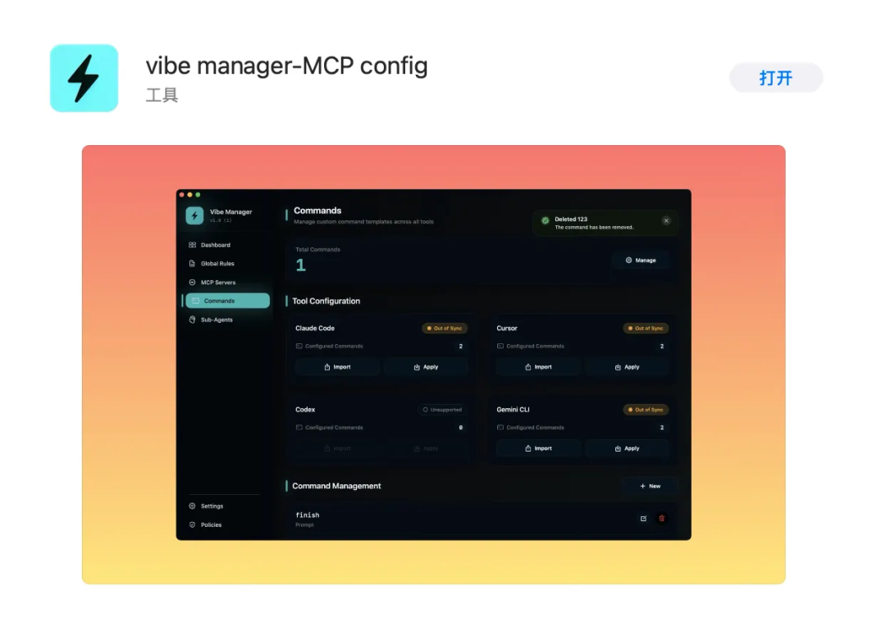
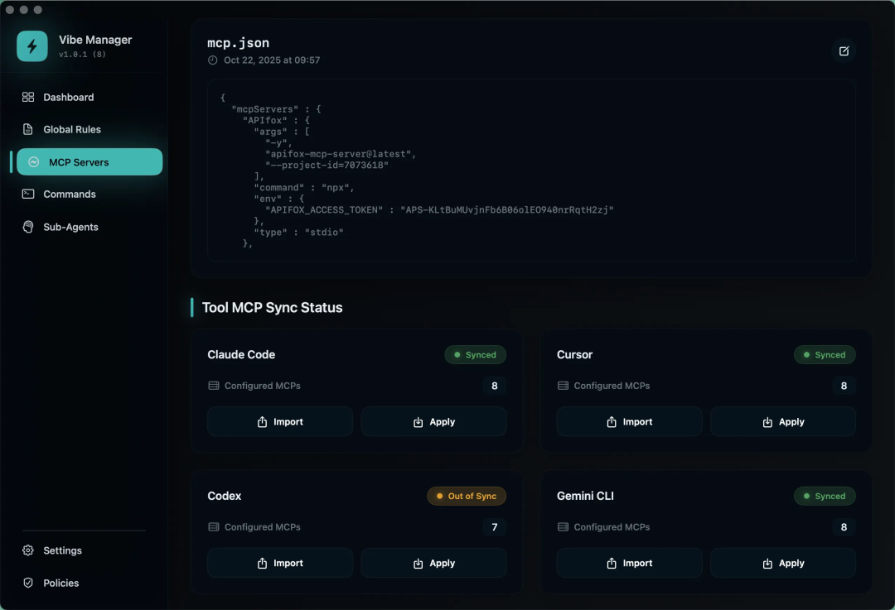
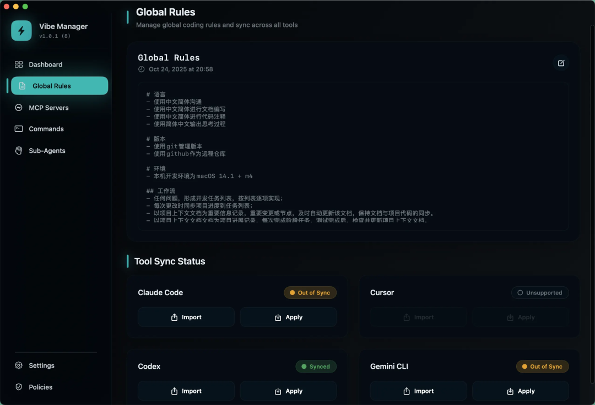
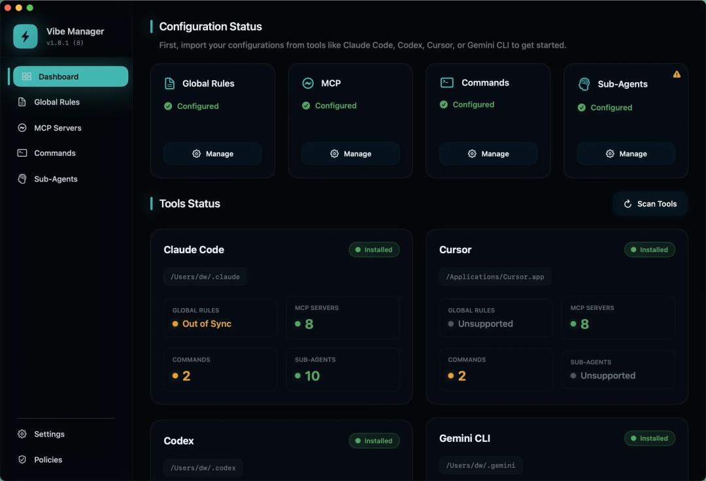

# Codex装MCP要手撸TOML？这个工具可视化一键搞定

codex装mcp费劲众所周知，我做了vibe manager，自动转换mcp格式，自动同步cursor、gemini cli、Claude code、codex cli的mcp列表！

在vibemanager中统一维护，一键同步到各个工具！

已经成功上架macOS应用商店，18元买断～

当然，作为原始股东～关注我私信领码免费下载哈～

## Vibe Manager能干嘛？

核心价值：mcp统一管理 + 自动格式转换 + 一键同步

✅ 统一管理开发规范 (rules)，一键同步！

✅ 统一管理自定义命令 (slash commends)，一键同步！

✅ 统一管理子智能体 (目前这个仅有Claude code支持，后续其他工具支持了再完善～)

(考虑中，大家有需求可以留言～)

你在Vibe Manager的界面里添加一次MCP，它会自动：

✅ 转成TOML格式，写入codex的配置文件

✅ 转成JSON格式，写入Claude Code的配置文件

✅ 同时支持Cursor、Gemini CLI

不用记TOML语法，不用手动改配置文件，点一下按钮就完成。

## 对比一下

👎手动配MCP：
怎么也得研究个10分钟～

用 Vibe Manager：

- 在界面里填好 MCP 的 JSON

- 点“同步到 Codex”，1 秒
- 完成

而且，同一个MCP配置，可以一键同步到Claude Code、Cursor、Gemini CLI，不用手动转格式。

同时还支持全局规则、自定义命令的管理和同步，目前支持主流的Claude code、codex cli、gemini cli、cursor，其他工具有需要可以评论留言～

*原文发布于：https://mp.weixin.qq.com/s/e9z95xbQ0Rj4Z2oGtvPStg*
