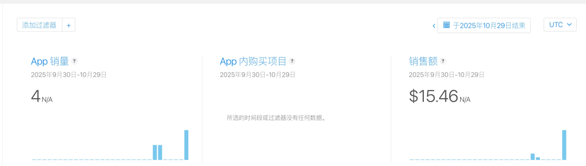
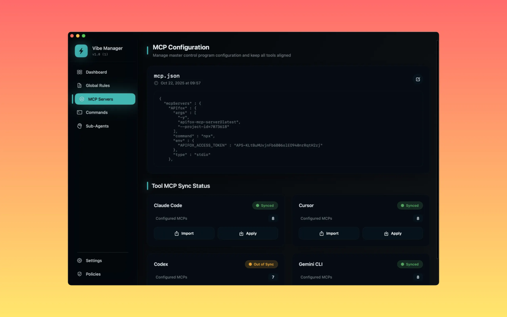
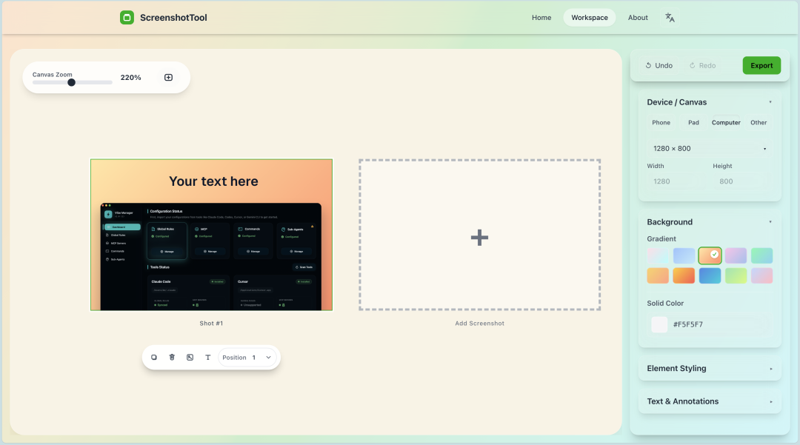

# macOS app上架五天，销售额15美金

上周把我的第一款工具应用 Vibe Manager 上架，今天去connect查了下趋势，结果发现了小惊喜：总共成交 4 单，其中 3 单来自国内低价区，1 单来自北美 9.9 美元。小额但真实，证明这条产品线跑通了。

## 我做了啥？

把最痛的点做成最小可用：一键把 MCP 与开发规则同步到多家 AI 编程工具（cursor、Claude code、gemini cli、codex cli）

## 关于定价

我没有用时下流行的订阅制，一个纯单机的配置管理工具，一次性买断对它的用户来说是最合理的定价方式。

介绍页：https://apps.apple.com/cn/app/vibe-manager-mcp-config/id6754086328?mt=12

国区定价18元买断，海外定价9.9刀乐买断～粉丝免费哈（领促销码）

## 接下来的打算

▸先在海外社媒做一轮轻量分发，Reddit、Product Hunt 的相关话题与合集，验证英文叙事与关键词

▸建立“推广 → 反馈 → 优化”的小循环：版本节奏更快，每次只解决一个明确障碍

▸同时开工新产品，把针对独立开发的相邻痛点串起来，做成组合拳，一个纯免费的应用商店预览截图网站已经即将上线了～有需要的宝子们提前关注一下～

后续我会持续分享从开发、上架到拿到第一笔收入的细节与复盘。

- 上架清单与避坑

- 海外渠道的推广记录

- 从首单到千刀的迭代节奏与指标表

关注我，一起把产品做成正循环！ 
 祝大家早日月入万刀！！！

## 关于我

60天，从产品经理到独立开发成功上架：vibe coding重新定义了“产品经理”

## 往期精品

有了这款号称UI界的Cursor！再也不担心vibe出来的页面难看啦！

超全超细！独立开发新人避坑指南！一文讲透！

Cursor + MCP 终极指南：从频繁断连到一键部署，稳定运行！

*原文发布于：https://mp.weixin.qq.com/s/r-MDBIWe0jmfaOQWGGEsQg*
