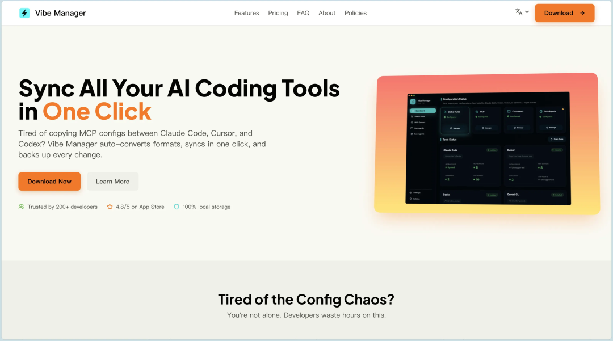

# App赚美刀出海营销第一步：上线产品介绍站



产品上线一周多之后，今天刚把 Vibe Manager 的产品介绍站也上线了：

[https://vibemanager.net](https://vibemanager.net)

在我看来，产品站不是锦上添花，而是 App 出海最基础的基础设施。

很多人的路径是：App Store 一上架，然后冲 Product Hunt、发 Reddit、等用户来。

但如果没有产品站，这条路会很别扭：

- Product Hunt 要放网站链接，直接贴 App Store 看起来就不专业
- Reddit 发帖没有演示页面，转化率会很惨
- 想投广告，连落地页都没有
- SEO 基本无从谈起，只能靠社交媒体冲短期流量

## 为什么产品站是刚需

### 1. SEO 是长期免费流量

社交媒体的流量很短：

- Product Hunt 第一天爆，第二天就可能断崖
- Reddit 帖子 48 小时后基本沉底
- Twitter 生命周期往往不到 24 小时

SEO 不一样，它是复利型的。

- 第 1 个月，可能只有 5 到 10 个自然流量 / 天
- 第 3 个月，可能涨到 20 到 50 个 / 天
- 第 6 个月，可能涨到 100 到 300 个 / 天
- 1 年后，甚至可能上千

我看过一个独立开发者的案例，上线两年后，80% 的新增用户都来自 Google，几乎不用再额外推广。

### 2. 它是所有营销渠道的统一落地页

数据上很直观：

- 直接贴 App Store，转化率可能只有 5% 到 10%
- 先让用户进入产品站看演示，再引导下载，转化率能到 15% 到 25%

Product Hunt 上也有类似规律：有独立站的产品，冲进 Top 5 的概率往往远高于只有 App 页的产品。

### 3. 品牌和专业度都更可控

App Store 的局限很明显：

- 布局固定
- 竞品广告可能出现在你的页面附近
- 差评可见
- 用户行为不容易追踪

而产品站的优势是：

- 页面完全可自定义
- 可以做 A/B 测试
- 可以接 Google Analytics
- 可以自己控制第一印象

### 4. 为后续增长留接口

有了产品站，后面你可以很自然地接这些能力：

- 博客，持续做内容引流
- 邮件订阅，承接产品更新和召回
- 多产品矩阵，统一品牌入口
- API 文档或帮助中心

这些东西如果现在不搭，后面再补会很麻烦。

## 我的站点实践

### 为什么我做了 13 种语言

我参考过一些成熟独立开发者的经验，发现多语言覆盖带来的收益非常直接。

我最后直接做了 13 种语言版本，用 AI coding 处理配置和翻译，几个小时就能跑完。

### 市场覆盖怎么理解

从搜索引擎和用户语言分布来看，英文远远不是全部：

- 英语：25%
- 日语：10%
- 欧洲五语（德 / 法 / 西 / 葡 / 意）：30%
- 韩语：5%
- 俄语：8%
- 其他亚洲语言：15%

只做英文，等于主动放弃大部分潜在用户。

### 技术成本其实不高

现在这套工具链已经很成熟了：

- Cursor 或 Claude / GPT 辅助翻译
- Astro 或 Next.js 自带 i18n 支持
- `hreflang` 也能自动生成

我这次整体投入下来，大概也就 4 小时左右。

## 为什么我选 Cloudflare Pages

### 1. 部署快

- 一键连接 GitHub
- 每次 push 自动构建上线
- 免费流量和带宽已经够早期产品用

### 2. 提交搜索引擎方便

Google Search Console 可以直接走 Cloudflare 授权验证，不用自己手搓 TXT 记录，省很多事。

### 3. 全球访问快

Cloudflare 自带全球 CDN 节点，对海外访问速度很友好，上线之后就能直接面向全球用户。

## 上线后的 SEO 配置流程

### 第 1 步：生成多语言 Sitemap

作用是告诉搜索引擎你有哪些页面，以及不同语言版本之间的对应关系。

关键检查点：

- `sitemap.xml` 能正常访问
- 每个 URL 都有完整的语言版本
- `x-default` 指向默认语言

### 第 2 步：提交 Google Search Console

流程很简单：

1. 打开 `search.google.com/search-console`
2. 添加资源，输入域名
3. 选择 Cloudflare 授权验证
4. 验证成功后提交 `sitemap.xml`

通常提交后不会立刻收录，等 3 到 7 天比较正常。

### 第 3 步：提交 Bing Webmaster Tools

这里最省事的做法，是直接从 Google Search Console 导入，验证和 sitemap 都能一起带过去。

### 第 4 步：配置 robots.txt

最简单也最够用的写法就是：

```txt
User-agent: *
Allow: /
Sitemap: https://yourdomain.com/sitemap.xml
```

### 第 5 步：验证是否生效

你至少要确认这几件事：

- `yourdomain.com/sitemap.xml` 能打开
- `yourdomain.com/robots.txt` 能打开
- Search Console 后台开始出现“已发现”或抓取记录

## 下一步推广动作

### 短期动作

- 准备 Product Hunt 发布
- 去 Reddit 的相关社区发帖
- 收集第一批用户反馈

### 长期动作

- 持续更新内容
- 跟踪 SEO 数据
- 优化关键词和页面转化率

## 三天执行清单

### Day 1

开发产品站，至少把首页、核心介绍、截图、FAQ 这些基础内容搭起来。

### Day 2

接入 Cloudflare Pages，绑定域名，确认自动部署和访问速度都正常。

### Day 3

生成 sitemap，提交 Google 和 Bing，补好 robots.txt，开始为 Product Hunt 和 Reddit 做准备。

## 总结

App 出海营销的第一步，不是发帖，不是投流，而是先把产品站这个地基打好。

后面不管是做 SEO、跑 Product Hunt、接广告还是做内容，都得靠它承接。

*原文发布于：https://mp.weixin.qq.com/s/V-srYm2OPLrRIpuO4_8i_Q*
