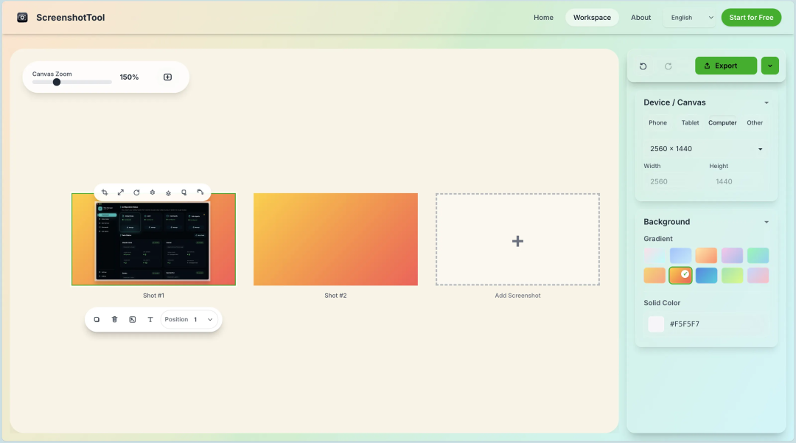
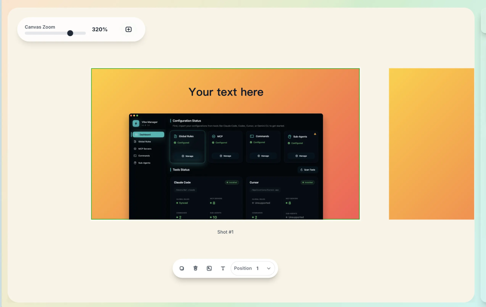

# 做App上架截图？这个工具完全免费！无水印！

上架App最烦的事：构建完成、提交app store结果卡在做应用商店截图。上架vibe manager着了各种工具，不是贵的一批就是不好使。我就想做几张干净的截图，咋就这么难？索性自己做了个：无需登录、完全免费、无水印、打开就能用网址：screenshot.vibemanager.net核心就一个原则：别恶心用户。1. 自定义尺寸，想要多大就多大App Store 要 1290x2796？直接设置Google Play 要 1080x1920？秒改做网站 landing page 用的宽屏图？随便设不限制尺寸，你的项目你做主。2. 自动配好圆角和阴影默认就是专业效果：12px 圆角（苹果风）40px 模糊 + 20% 透明度阴影不用自己调参数，开箱即用。当然，想改也能改。3. 10+ 渐变背景预设不是那种红配绿的辣眼睛配色，都是精心调的：冷色系（蓝紫渐变）暖色系（橙粉渐变）中性色（灰白渐变）或者纯色背景（自己定义颜色）默认的浅灰背景就很耐看，跟苹果官网一个色号。4. 导出无水印，自选格式PNG（高清无损）JPG（文件小）零水印，你的作品不会被打logo5. 支持13种语言，全球化友好网站内置13种语言版本：中文、英文、日文、韩文西班牙语、法语、德语、意大利语葡萄牙语、俄语、阿拉伯语、印地语、土耳其语不管你的产品面向哪个市场，界面都能无缝切换。6. 零后端，隐私安全所有处理都在浏览器本地完成：截图不会上传到服务器不收集任何数据不需要注册登录打开就用，用完就走。对比市面上的工具我自己踩过的坑：某在线截图工具：免费版导出带大水印去水印要付费，一个月20刀我就做3张图，凭啥包月？这个工具：完全免费无水印打开网页就能用30秒出图支持13种语言成本对比不做表格了，直接说：市面上那些工具要么收费19.9刀/月，要么免费版带水印。Figma和PS虽然专业，但对于做几张截图来说太重了。这个工具完全免费、无水印、打开就能用，还支持13种语言，30秒搞定。适合谁用？• 独立开发者上架App，需要快速做几张商店截图• 没有设计师，自己搞定应用素材• 不想为了做图订阅一堆工具• 追求简单高效，不要花里胡哨的功能• 产品多语言上架，需要不同语言的界面真实使用场景我自己的 Vibe Manager 上架时，所有应用商店截图都是用这个工具做的：• 3分钟做完5张截图• 统一风格的渐变背景• 圆角阴影自动配好• 导出无水印，直接上传App Store从此不用再为做个截图这种小事折腾半小时。一句话总结：做应用截图，不要水印、不花钱、打开就能用，30秒搞定专业效果，还支持13种语言。试试看：screenshot.vibemanager.net评论区聊聊，你现在用什么工具做应用截图？踩过哪些坑？关注我，一起把产品做成正循环！ 祝大家早日月入万刀！！！关于我：60天，从产品经理到独立开发成功上架：vibe coding重新定义了“产品经理”往期精品：有了这款号称UI界的Cursor！再也不担心vibe出来的页面难看啦！超全超细！独立开发新人避坑指南！一文讲透！Cursor + MCP 终极指南：从频繁断连到一键部署，稳定运行！

*原文发布于：https://mp.weixin.qq.com/s/JYyCLmngh68DczX6cAUlig*
