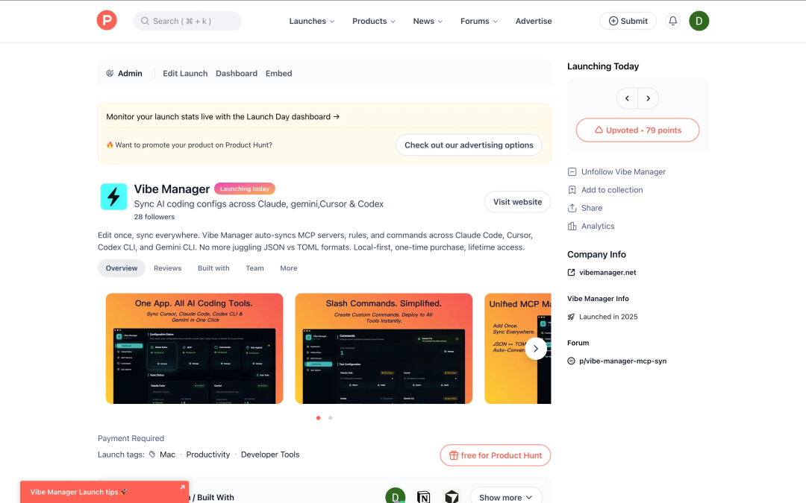
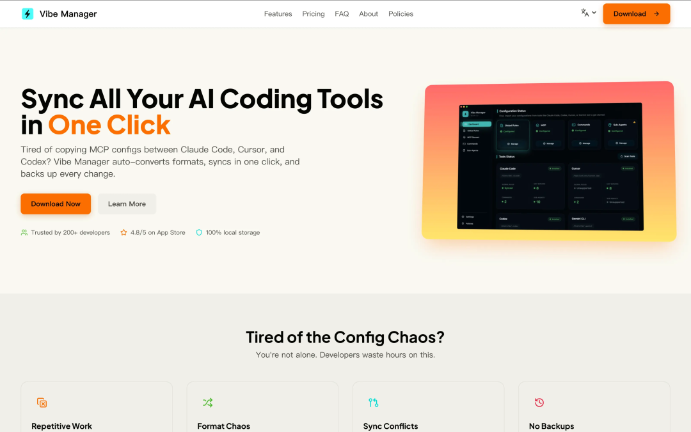
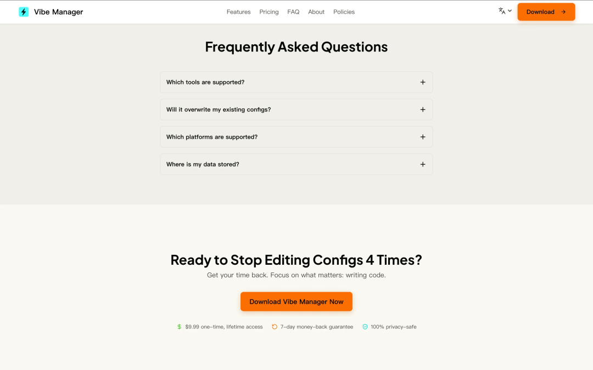
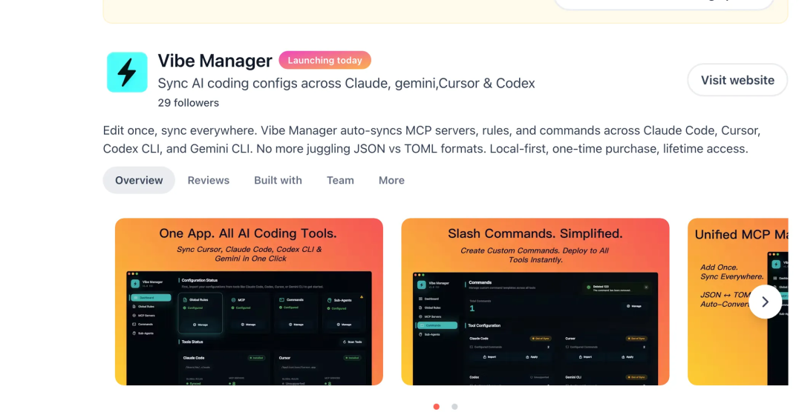
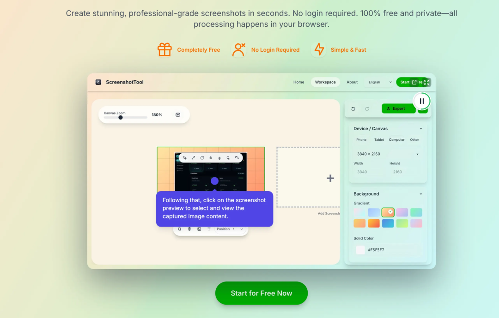

# App赚美金出海营销第二步：讲清Product Hunt发布

有app没用户，发朋友圈没人看，推特也没声量？先去试试 PH，PH是一个专业的产品发布社区，这里很多人愿意看看这些新产品，愿意去做种子用户。今日实测4 点发布vibe manager，6点进去看，已到 77 points、26 followers 。项目链接：https://www.producthunt.com/products/vibe-manager-mcp-syn?comment=4995851为什么第二步是 PH？第一步我已经写过：先搭一个像样的产品网站，提升信任与专业度（域名、About、FAQ、Terms、隐私政策、截图墙）。没有官网，PH 流量来了也会白白流走。第二步再上 PH，把“对的人”导到你的网站（而不是 App Store 单页），用页面承接信任与转化，从而获取第一批也是最容易获取的一波用户。常用的发布配置一、官网提前准备首页一屏说清“它解决什么问题”，3 句以内必备页：Pricing、FAQ、About、Terms、Privacy二、截图与短演示准备（截图必要，演示强烈推荐）截图要“讲故事”：界面、功能、价值（这里推一下我的免费截图工具，有需要的朋友看我之前的帖子）做一个 30-60 秒交互演示，即可以增加专业性，放到官网还能提升信任度和转化率用 supademo，免费14天，录个屏就能自动生成交互步骤、光标移动和字幕说明，像“视频”但比录屏更清楚，甚至能鼠标一步步交互Supademo ：https://supademo.cello.so/nFUzUyHgiHe三、PH 页面素材标题：一句话定位 + 目标人群标签：工具类型 + 目标用户（developer tools / productivity / AI 等）“介绍”区块：用 3 段式结构段1：痛点场景段2：你的解法 + 关键差异段3：数据或承诺（30 分钟可上手 / 永久买断 / 本地隐私）首评（maker comment）提前写好，固定在评论区顶端，告诉大家你希望得到什么反馈时间与节奏发布时段选“目标用户在线的上午时段”（太晚时区会错失早盘动量）第一小时盯评论、补充 FAQ、修 typo，别指望“发完就行”我这次的即时反馈（供参考）4 点发，6 点看：77 points、26 followers点赞与关注的节奏稳定，来自真实产品人，后续复盘会针对评论集中问题继续打磨小结：专业性 + 清晰定位 + 可操作演示，确实更容易打动 PH 的人群PH 的“分数/排名”怎么来的？点赞（upvote）是主维度，但不是“全量加权齐刷刷加分”，质量与时序更重要早期动量、评论互动、介绍页信息完整度、外部流量质量都会影响当日热度账号可信度有加成：真实头像、过往互动、是否为 maker、是否在站内活跃当日榜单按太平洋时间新一天刷新，节奏管理要贴着你的核心用户时区重点：引导有价值的讨论与问题，比“求赞”更有效。PH 的社区氛围偏专业、务实先拿 maker 身份现在 maker 身份更有用：你的账号与项目露出更可信发言与互动在社区里更容易被看到所以建议“尽早上传一个自己的作品”，不论成熟度如何，先拿到 maker，再滚动迭代关注我，后续分享更多出海营销以及app开发相关内容～祝大家早日月入万刀！一起把产品做成正循环！

*原文发布于：https://mp.weixin.qq.com/s/ZssV484NGaW2wKfkjuQgYQ*
