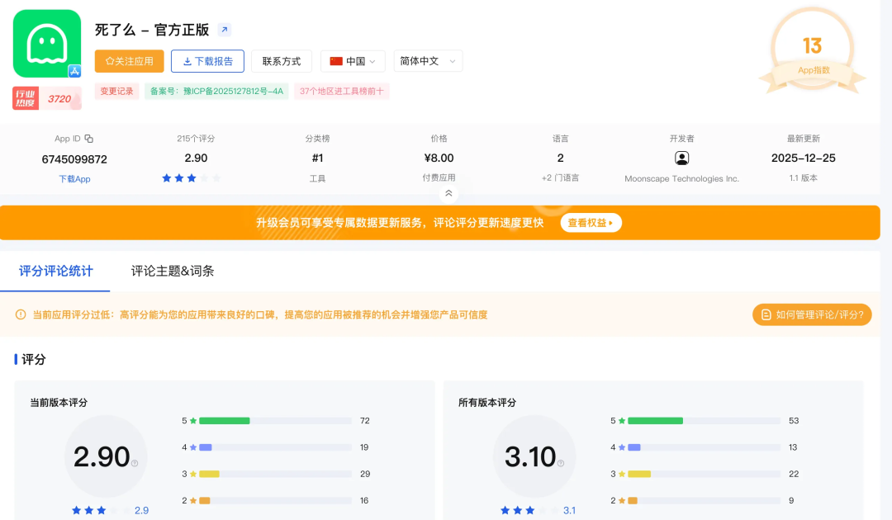
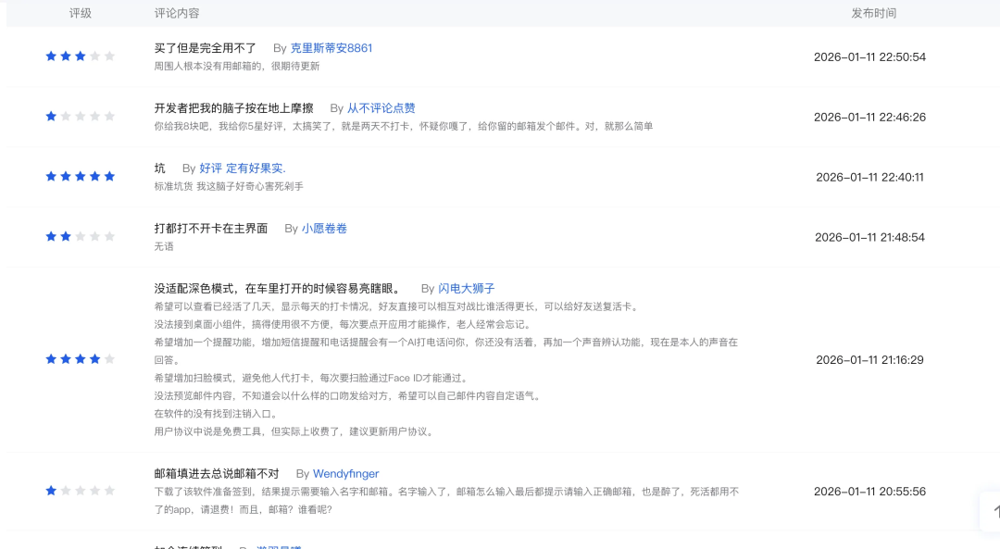

# 「死了么」APP“爆火”？然而真实数据是……

最近这个“死了么”APP简直夸张啊，不是这个APP本身怎么样，是某号和某书这些社媒疯了，一打开就推这玩意。说实话，今天写这个呢，是我发现真的有很多朋友就信了，还很认真的在讨论这个app咋样啊，压中了现在独居人的需求啊巴拉巴拉。今天还看到说都融资千万了，然而了解了一番发现，实际是：创始团队说考虑以100万让出10%股份融资，就有语文不行的人开始造谣直接传成融资千万了。。。好家伙，那其实我正考虑融资2个小目标。真相是这样所以今天其实是想吐槽吐槽，把这个app真实情况是咋样给大家看看。12月一开始有这个app传播我其实就知道了，当时只觉得这就是个笑话，但确实是低估了这个笑话的传播性，但是，并不影响这玩意现在依然是个笑话。产品性来讲：我们都知道，一个成功的产品，能被估值的app，那它一定是验证了某块市场需求的，有用户因为他的可用性买单的。这里有两个关键词，实际解决和真实需求。我不否认独居群体需要关怀是个真实需求，日本近些年传出好多独居在家里凉了都没人知道的，这一点没毛病，不是伪需求。但是，这个app实际解决了吗？这就是很大的问题了，我认为这app就是搞笑的，核心原因就是这个，他是什么运转逻辑：有紧急联系人；每天手动打卡；连续两天未打卡，发送邮箱进行通知。他支持中英文，整体还是针对中国设计，然而中国独居者还需要这种关注的，多半没啥年轻人（年轻人要上班的）。那就定位到中老年，还没啥社交的中老年，首先这位中老年不能用老人机，得用智能机。其次，他必须每天记得打开app去打卡，两天没打，就发邮件给你亲人，给人吓一大跳。。。我估计我要是给我家里老爷子装上这app，我每天都得提心吊胆。这就是我认为这就是个笑话的原因，这也不是我的臆测，app评论都证明了，火了没两天，评分都掉到2.9了。截图来自于点点数据。聊聊这玩意挣到钱了吗以及怎么挣的可以肯定的是，肯定挣到钱了，小几万肯定还是有的，就最近几天这些营销号吹出去，好奇下载的，都得有4位数，一个卖8块付费下载，挣钱是必然的。确实能靠着流量捞一笔快钱，这点不得不佩服，就不要口碑，就吃流量钱哈哈哈，要我说这开发团队去搞短视频都比这挣钱，这网感是真的强。至于怎么挣的，刚才其实也说了：首先这名字太搞了，抽象易于传播，营销号都会蹭这个热度，越蹭热度越高，正循环，引导广大网友花8块钱买个好奇心哈哈哈。还有一点值得我们学习：自己知道做的一般的产品，就搞付费下载。懂得都懂哈哈哈。综上所述，这app本身是个抽象营销，但这个需求却是是真的，要有朋友有能力真实解决问题，倒是可以抓紧动手，还能接上这波红利。

*原文发布于：https://mp.weixin.qq.com/s/vnLx9M0xM8HaelydxRv5qw*
