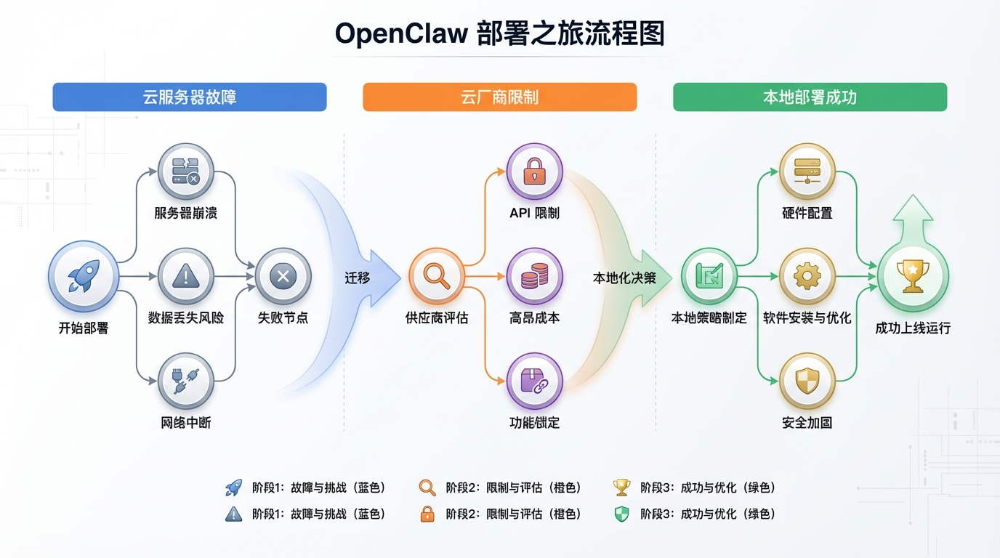
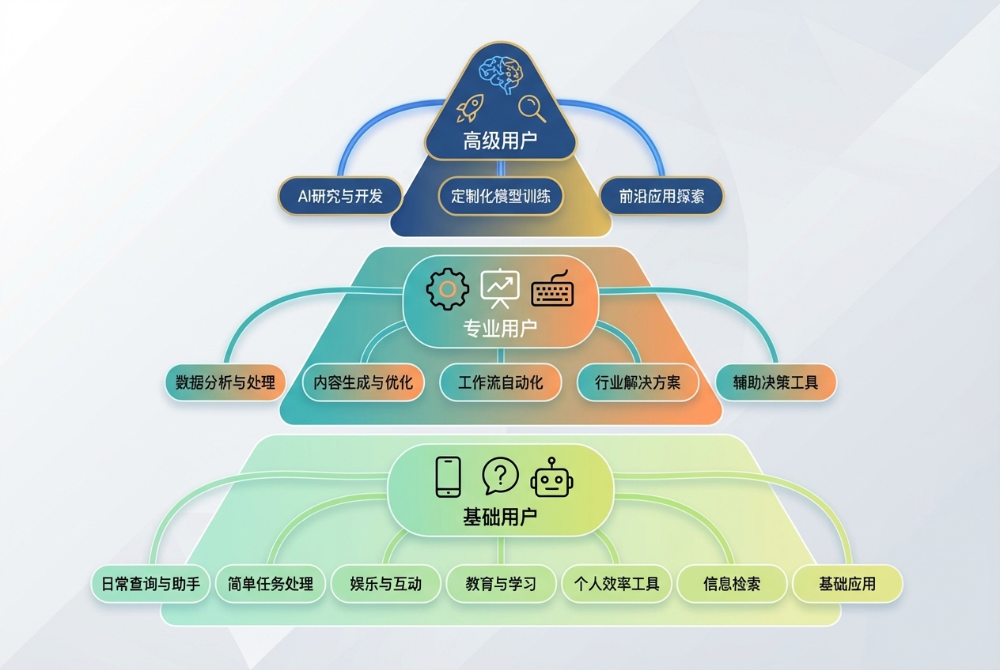
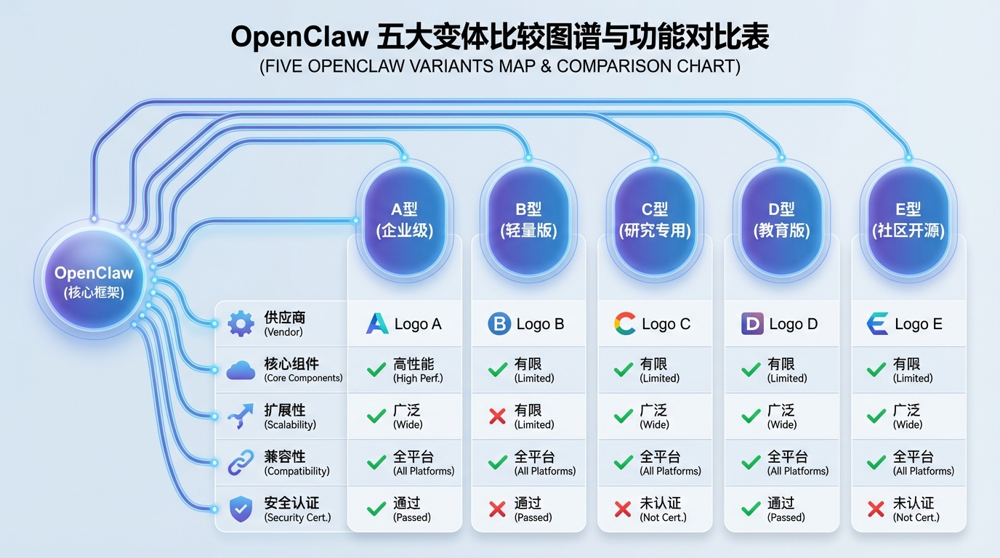

# OpenClaw 部署一个月踩坑实录：从云服务器到本地 Mac

我花了一个月测试 OpenClaw 的各种部署方案。

不是三天，也不是一周——整整一个多月。

2 月初 OpenClaw 在 GitHub 上到 16 万星的时候，我作为产品经理出身的独立开发者，觉得这东西应该不难。结果试了一圈才发现，坑比想象的多。

今天把我踩过的坑整理出来，给想部署的人一个参考。

---

## 云服务器自部署

我先用了一台闲置的云服务器，2 核 2G，国内节点，一年 90 块。

聊两句就崩，定时任务根本跑不起来。

升级到 2 核 4G，好了点，但复杂任务还是崩。内存泄露严重，得定时重启。发消息过去经常没反应——进程早挂了。

更麻烦的是国内节点访问不了海外资源。GitHub、Clawhub 完全下不了，skill 下载老报错。所谓的"网络优化"只针对国内网站，该墙的还是墙。

低价国内节点套餐，配置不够，网络也不行，不适合跑 OpenClaw 自动化。

---

## 一键部署方案

云服务器搞不定，我又试了 Kimi Claw、Max Claw 这些一键部署。

配置确实简单，点几下就行。我还买了单月套餐。

但问题很明显：

服务器在国内，海外资源照样访问不了，GitHub 下载 skill 报错。

自由度极低。只能用他家套餐，不能换自己的 API Key。出问题不知道怎么排查——我的 Kimi Claw 就卡住过，完全没辙。

IP 也是问题。数据中心 IP 遇到反爬机制就被识别，直接封掉。

云端部署省的是配置时间，丢的是自由度、稳定性和排查能力。出问题只能干瞪眼。

---

## 本地部署

云端的坑踩完了，我意识到得本地部署。

本地部署分两条路：厂商封装版本，或者原生 OpenClaw。

---

## 我的结论

折腾一个多月，我总结了一个分层方案。

**第一层：纯小白，先建立认知**

推荐 Kimi、Manus。成熟的云端智能体产品，登录就能用。能做浏览器自动化、跑脚本、写文档、定时报告这些云端操作。

功能相对固定，不支持太灵活的干预和配置。

选这层的目标不是干活，是建立认知。先知道智能体能做什么，产生想象，再谈别的。

**第二层：本地自动化，让 AI 帮你干活**

推荐智谱 AutoClaw（澳龙）。本地一键安装，7×24 小时自动运行。

在第一层能力基础上，做本地灵活的深入自动化。操作电脑里的文件、定时整理报告、出课件、结合实际工作的本地流程。

手机号登录 3 分钟搞定，能自由切换模型（DeepSeek/Kimi/MiniMax/GLM），500 积分免费，最低 29 元起。

这层是让 AI 真正帮你干活，在你的本地电脑上干活。目前性价比最高。

**第三层：追最前沿，探索技术边界**

推荐原版 OpenClaw + 本地 Mac 部署。开源原生版本，自己配代理、自己配 API Key、自己负责安全。

所有最新的探索性功能最先出现在这里。大厂变体都是基于它封装，但开源版永远走在最前面。

适合 AI 博主、科技博主、互联网从业者，想了解 AI 技术发展趋势、最新解决方案的人。

代价是自己维护，自己负责安全。

---

## 最后说几句

OpenClaw 火得有点突然。

大厂密集下场，不是因为技术多牛，而是因为这是一个入口。每次部署都是在用户电脑里埋下一台 24 小时运行的"算力抽水机"。

但对普通用户来说，门槛确实被打下来了。

以前需要懂 Docker、懂代理、懂 API 配置。现在手机号登录，3 分钟搞定。

以前被某一家模型绑定。现在 DeepSeek、Kimi、MiniMax、GLM，随便换。

> **技术的意义，是让普通人也能用上好东西。**

从这个角度来说，智谱澳龙确实做到了。

你属于哪一层？
