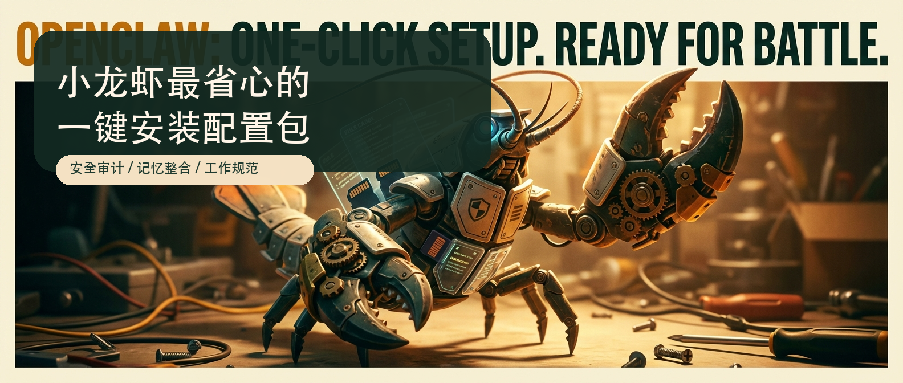
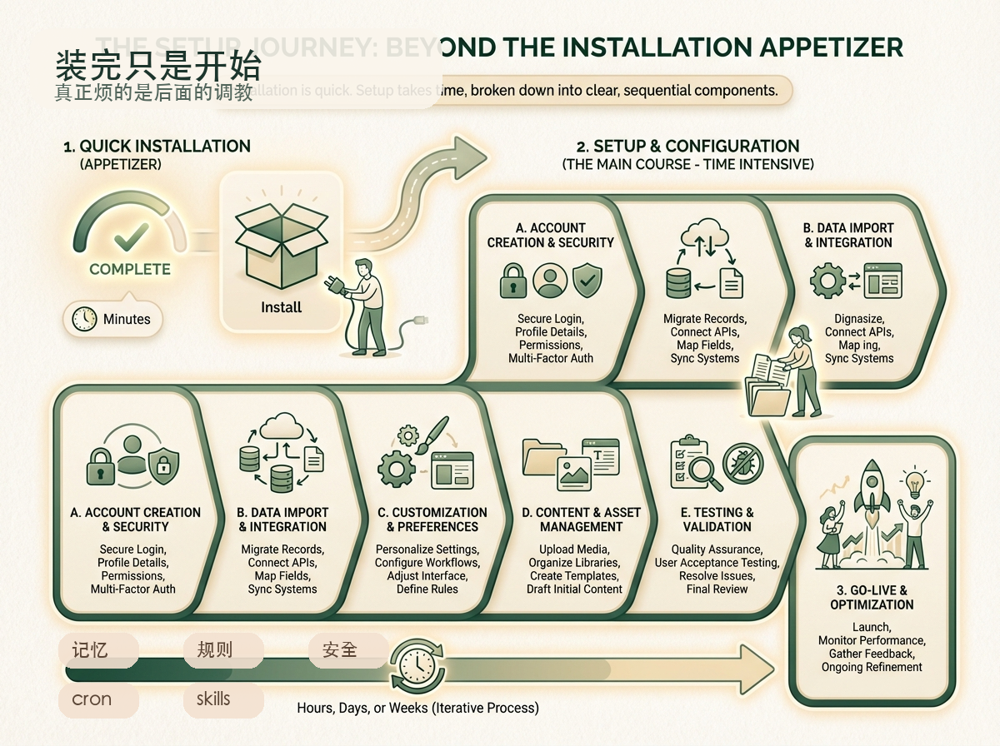
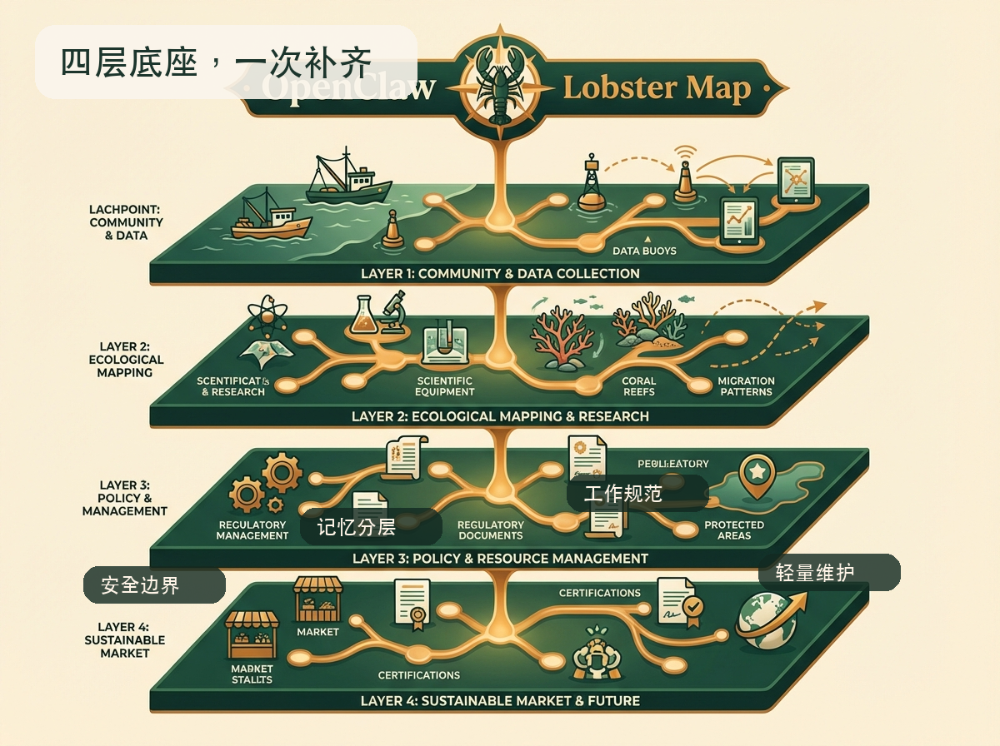
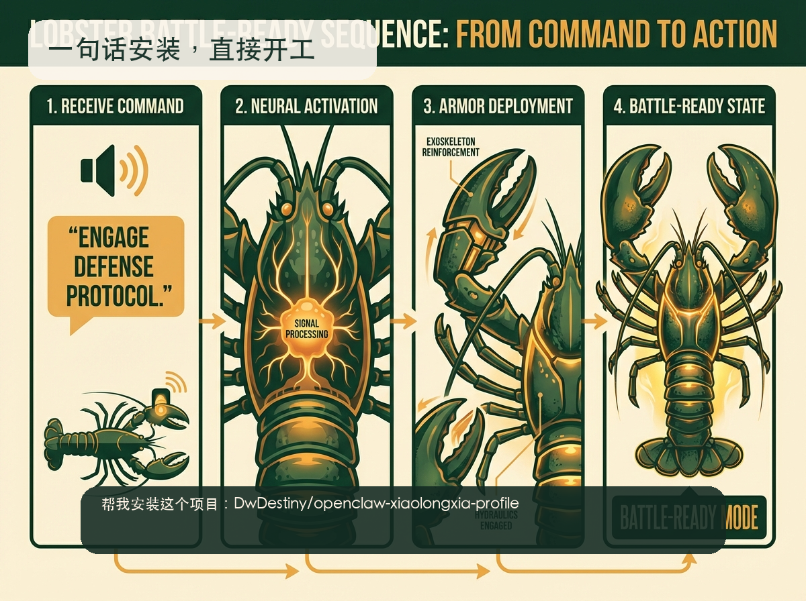

# 小龙虾最省心的一键安装配置包来了：安全审计、记忆整合、工作规范一次装好



我一开始也以为，小龙虾装好就差不多了。

后来发现根本不是。

安装只是前菜，后面的调教才是真正吃时间的地方。你得自己慢慢补记忆、补规则、补安全、补 cron。最坑的是，这些东西根本没有一份大家默认照着走的标准答案。所以最后每个人都在重复做同样的事：换一只虾，再重新调一遍。

这也是我后来决定做这个包的原因。不是因为安装难，而是因为装完之后那堆零碎事，真的太浪费时间了。

## 真正麻烦的，不是安装，是装完之后那堆碎事

现在网上教你装 OpenClaw 的教程已经很多了。保姆级的、图文版的、视频版的，都不缺。

真正缺的，反而是另一层东西：你把小龙虾装完之后，怎么别再自己从零开始慢慢调。

因为真正折腾人的，从来都不是“装不上”，而是“装上了，但后面还有一堆事没人替你收好”。记忆怎么分层，规则写到哪，哪些东西该自动开，哪些不能乱开，安全边界到底收多紧，才不会影响体验？这些问题单看都不大。真正恶心人的地方是：它们全都散着。今天这里补一点，明天那里抄一点，后天再自己改一点。最后你就会发现，每装一只新的小龙虾，都像重新走一遍老路。

这事干一两次还行。一旦你真的开始长期用，或者开始给不同场景配不同的虾，就会越来越烦。



所以我后来想得很简单：与其每次重新摸，不如干脆把这套最通用、最容易被忽略、但后面一定会反复用到的底座，直接收成一个一键安装包。

小龙虾装完。再装这个包。直接进入战斗状态。

不是继续学半天，不是再自己查半天，也不是装完之后再花几个小时慢慢补洞。而是先把最该有的那层底座一次性装上。

## 它不是花活，它是在补底座

我做这个包的时候，脑子里想得很清楚。

这东西不能是某个角色专用包，也不能写死某个业务场景，更不能搞成一个只有我自己能用、别人拿过去就废掉的半成品。

我要的就是通用。只要你在养小龙虾，这些问题你迟早都会碰到。那就别等踩完坑再一个个补，直接先把最该有的底座打上。

所以这个包补的，不是表面花活。补的是最底层、最通用、最容易被忽略，但后面最影响使用体验的四件事。

## 这套包，一次帮你补四层底座



### 1. 先把安全边界收起来

很多人一开始玩小龙虾，注意力都在模型、skill、渠道接入这些更显眼的地方。安全这种事，嘴上都知道重要，但真落到配置里，经常就两种情况：一种是根本没配，另一种是一下子收得太死，最后连正常使用也一起废了。

我自己后面越来越确定，安全这件事最怕的不是不懂，最怕的是又想要能力最大化，又懒得先打底线。

所以我这个包里放的，不是什么夸张的大而全安全系统，而是最通用、最值得先补上的那层边界：

- 外部输入默认零信任
- 敏感动作先确认
- 高风险目录默认不读
- secret 不进 seed，不进模板真值
- 安装脚本优先幂等，不强覆盖

说白了，不是为了把小龙虾关成残废，而是别让它一开局就裸奔。

### 2. 把记忆从一锅粥，变成分层结构

很多人会说，小龙虾刚开始挺聪明，后面怎么越来越不稳定。这里面有一大块问题，不在模型，在记忆。

今天聊出来的东西写哪？长期规则写哪？用户画像写哪？工具和路径写哪？如果这些全混在一起，前几天看着还能凑合，时间一长，肯定开始乱。你自己看着都乱，小龙虾当然更容易断片。

所以这个包直接先把记忆分层给你搭好：

- `memory/YYYY-MM-DD.md` 放 daily note
- `MEMORY.md` 放长期事实
- `USER.md` 放用户稳定画像
- `TOOLS.md` 放工具和路径规则

这不是为了显得专业，这是为了后面真的接得上。你不用每次都想“这条到底记哪”，这件事一旦不需要你反复判断，后面就会轻松很多。

### 3. 先把工作规范定下来

很多返工，其实不是因为小龙虾不聪明，是因为从一开始，就没人告诉它什么该怎么做，什么不能乱做。

规则不清，边界不清，风格不清，执行顺序不清，最后当然越跑越偏。

所以我这个包会补齐一批核心骨架文件，比如：

- `AGENTS.md`
- `SOUL.md`
- `USER.md`
- `IDENTITY.md`
- `WORKFLOW.md`

这些东西如果只是看名字，容易被理解成“设定文件”。但在我这里，它们不是拿来装样子的。它们的作用很现实：先把行为边界、执行顺序、风格偏好、工作方式这些基础规则定下来。你后面再加 skill，再接业务，再扩流程，底层才不会一直飘。

### 4. 该自动的，先低风险自动起来

还有一类事情，平时都知道有价值，但一忙起来就最容易拖。比如记忆蒸馏、每周复盘。

你平时知道应该做，但真让你手动天天补，最后大概率就是：算了，先放着。然后等真出问题了，再回头补救，这时候代价通常已经比你想象的大了。

所以我这个包默认会自动注入并启用两类低风险内部 cron：

- `memory_daily_distill`
- `weekly_self_review`

注意，我这里很刻意地只开低风险内部任务。涉及外发、真实账号绑定、系统级 cron 这些，我还是继续留给人工确认。

这也是我很看重的一条原则：该自动的自动，不该自动的，不乱自动。

因为很多初始化方案最后体验差，不是因为它自动化不够，而是因为它自动得太猛。用户一装完，自己反而不敢用了。

我不想做这种东西。我想做的是：先把 80% 最烦、最重复、最通用、最该有的东西自动补齐。剩下那 20% 真需要你自己拍板的部分，继续交还给你。

这样装完之后，你不会觉得自己又多了一个要重新研究半天的新系统。你会更像是终于有人把那些本来就该先做、但每次都没人替你收好的活，先帮你干掉了。

## 用法其实就一句话

这套东西我后来也故意收得很简单。

因为用户不需要知道里面有哪些脚本、哪些 seed、哪些 manifest、哪些 cron 模板。这些细节是给底层执行用的，不是给普通用户增加负担用的。

对用户来说，最简单的使用方式就一句话：

```text
帮我安装这个项目：https://github.com/DwDestiny/openclaw-xiaolongxia-profile
```

就这么简单。

把链接丢给小龙虾。让它帮你安装。装完直接进入战斗状态。



该补的安全、记忆、规范、轻量自动维护，这些底层东西先一次补上。你不用再自己一条条补，更不用每次都从零重新摸一遍。

## 最后一句

我现在越来越觉得，未来养小龙虾，真正拉开差距的，未必是谁装得更快，而是谁先把底座打好。

模型决定上限。底层配置决定它能不能稳定进入战斗状态。

会装，只是入场。装完就能打，才是战斗力。

如果你也不想每装一只小龙虾，就再从头调教一遍。这套最省心的一键安装配置包，你可以直接拿去用。